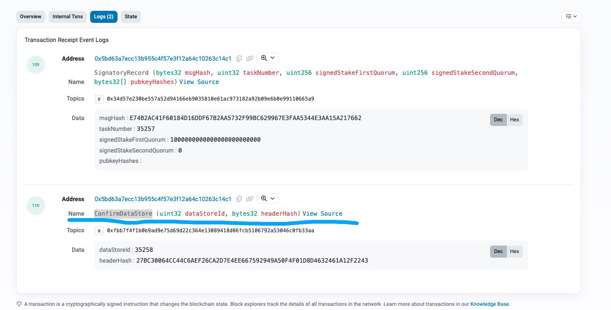
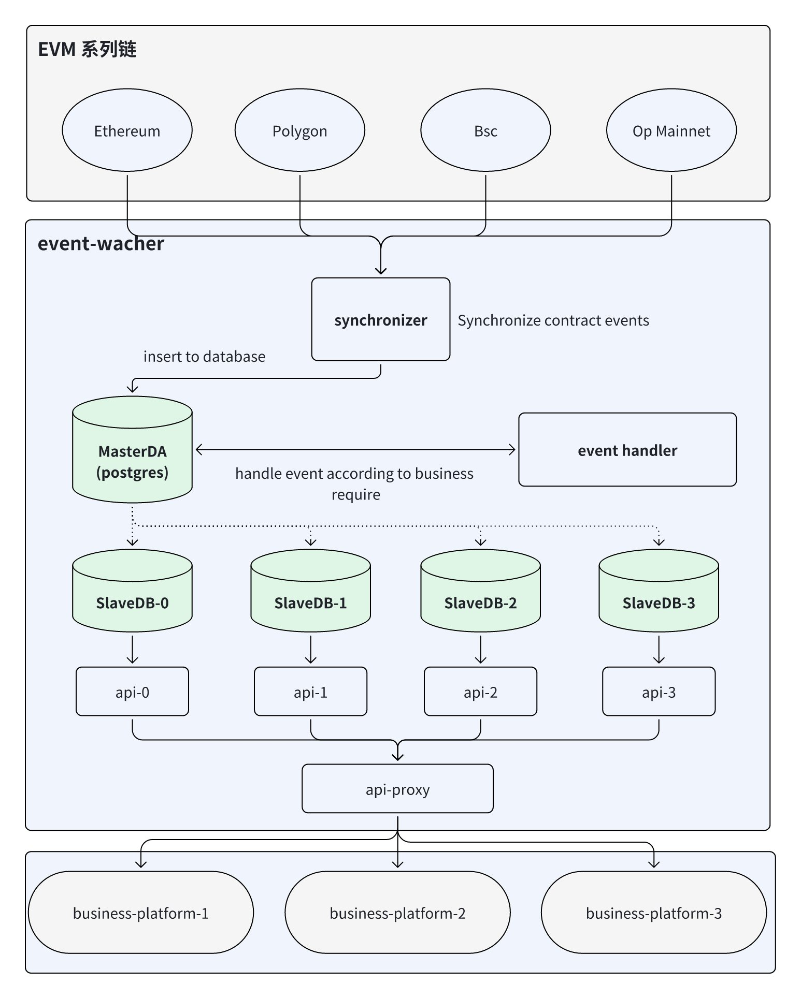

# Golang 监听 Ethereum 合约事件实战

# 1.常用的可以获取到合约事件的 ETH 接口

## 1.1.**eth_getLogs 或 eth_getFilterLogs**

eth_getLogs 接口的特点就是，可以传入以下参数去获取合约事件， eth_getLogs 可以传入开始的区块和结束区块链，合约地址等参数，会返回该合约地址相关的事件，拿到事件之后根据 ABI 解析

```go
// FilterQuery contains options for contract log filtering.
type FilterQuery struct {
    BlockHash *common.Hash     // used by eth_getLogs, return logs only from block with this hash
    FromBlock *big.Int         // beginning of the queried range, nil means genesis block
    ToBlock   *big.Int         // end of the range, nil means latest block
    Addresses []common.Address // restricts matches to events created by specific contracts

    // The Topic list restricts matches to particular event topics. Each event has a list
    // of topics. Topics matches a prefix of that list. An empty element slice matches any
    // topic. Non-empty elements represent an alternative that matches any of the
    // contained topics.
    //
    // Examples:
    // {} or nil          matches any topic list
    // {{A}}              matches topic A in first position
    // {{}, {B}}          matches any topic in first position AND B in second position
    // {{A}, {B}}         matches topic A in first position AND B in second position
    // {{A, B}, {C, D}}   matches topic (A OR B) in first position AND (C OR D) in second position
    Topics [][]common.Hash
}
```

- BlockHash：区块Hash
- FromBlock: 查询合约事件的开始区块
- ToBlock：查询合约事件的结束区块链
- Addresses：需要查询的合约地址列表
- Topics：查询查询的合约事件的 topics

# 2.eth_getTransactionReceipt 的方式获取合约事件

传入交易 Hash 之后可以获取到交易的 Receipt, 其实有一个字段为 logs 就是合约该笔交易里面的合约事件列表，交易返回值，拿到 logs 之后根据 ABI 解析合约事件。

```go
type Receipt struct {
    // Consensus fields: These fields are defined by the Yellow Paper
    Type              uint8  `json:"type,omitempty"`
    PostState         []byte `json:"root"`
    Status            uint64 `json:"status"`
    CumulativeGasUsed uint64 `json:"cumulativeGasUsed" gencodec:"required"`
    Bloom             Bloom  `json:"logsBloom"         gencodec:"required"`
    Logs              []*Log `json:"logs"              gencodec:"required"`

    // Implementation fields: These fields are added by geth when processing a transaction.
    TxHash            common.Hash    `json:"transactionHash" gencodec:"required"`
    ContractAddress   common.Address `json:"contractAddress"`
    GasUsed           uint64         `json:"gasUsed" gencodec:"required"`
    EffectiveGasPrice *big.Int       `json:"effectiveGasPrice"` // required, but tag omitted for backwards compatibility
    BlobGasUsed       uint64         `json:"blobGasUsed,omitempty"`
    BlobGasPrice      *big.Int       `json:"blobGasPrice,omitempty"`

    // Inclusion information: These fields provide information about the inclusion of the
    // transaction corresponding to this receipt.
    BlockHash        common.Hash `json:"blockHash,omitempty"`
    BlockNumber      *big.Int    `json:"blockNumber,omitempty"`
    TransactionIndex uint        `json:"transactionIndex"`
}
```

- Logs   []*Log `json:"logs"    gencodec:"required"` 就是这个字段

# 3.**eth_getLogs 和 eth_getTransactionReceipt 实际案例**

## 3.1.解析的交易事件

以该笔交易的 https://etherscan.io//tx/0xfd26d40e17213bcafcf94bab9af92343302df9df970f20e1c9d515525e86e23e

的 ConfirmDataStore 合约事件为例进行解析。



## 3.2.实际代码

- Client 代码封装

```go
package ethereum

import (
    "context"
    "fmt"
    "math/big"

    "github.com/ethereum/go-ethereum"
    "github.com/ethereum/go-ethereum/common"
    "github.com/ethereum/go-ethereum/core/types"
    "github.com/ethereum/go-ethereum/ethclient"
)

type EthClient struct {
    client *ethclient.Client
}

func newEthClients(rpcUrl string) (*EthClient, error) {
    client, err := ethclient.DialContext(context.Background(), rpcUrl)
    if err != nil {
       fmt.Println("dail eth client fail")
       return nil, err
    }
    return &EthClient{
       client: client,
    }, nil
}

func (ec EthClient) GetTxReceiptByHash(txHash string) (*types.Receipt, error) {
    return ec.client.TransactionReceipt(context.Background(), common.HexToHash(txHash))
}

func (ec EthClient) GetLogs(starkBlock, endBlock *big.Int, contractAddressList []common.Address) ([]types.Log, error) {
    filterQuery := ethereum.FilterQuery{FromBlock: starkBlock, ToBlock: endBlock, Addresses: contractAddressList}
    return ec.client.FilterLogs(context.Background(), filterQuery)
}
```

- 测试获取合约事件解析代码

```go
package ethereum

import (
    "fmt"
    "math/big"
    "strings"
    "testing"

    "github.com/ethereum/go-ethereum/accounts/abi"
    "github.com/ethereum/go-ethereum/common"
    "github.com/ethereum/go-ethereum/crypto"
    "github.com/ethereum/go-ethereum/log"
)

const ConfirmDataStoreEventABI = "ConfirmDataStore(uint32,bytes32)"

var ConfirmDataStoreEventABIHash = crypto.Keccak256Hash([]byte(ConfirmDataStoreEventABI))

const DataLayrServiceManagerAddr = "0x5BD63a7ECc13b955C4F57e3F12A64c10263C14c1"

func TestEthClient_GetTxReceiptByHash(t *testing.T) {
    fmt.Println("start...........")
    clint, err := newEthClients("https://rpc.payload.de")
    if err != nil {
       fmt.Println("connect ethereum fail", "err", err)
       return
    }
    txReceipt, err := clint.GetTxReceiptByHash("0xbc00672e67935e54c08d895b88fe41aa5cf664dc8f855836c7d26726e0c59ea4")
    abiUint32, err := abi.NewType("uint32", "uint32", nil)
    if err != nil {
       fmt.Println("Abi new uint32 type error", "err", err)
       return
    }
    abiBytes32, err := abi.NewType("bytes32", "bytes32", nil)
    if err != nil {
       fmt.Println("Abi new bytes32 type error", "err", err)
       return
    }
    confirmDataStoreArgs := abi.Arguments{
       {
          Name:    "dataStoreId",
          Type:    abiUint32,
          Indexed: false,
       }, {
          Name:    "headerHash",
          Type:    abiBytes32,
          Indexed: false,
       },
    }
    var dataStoreData = make(map[string]interface{})
    for _, rLog := range txReceipt.Logs {
       fmt.Println(rLog.Address.String())
       if strings.ToLower(rLog.Address.String()) != strings.ToLower(DataLayrServiceManagerAddr) {
          continue
       }
       if rLog.Topics[0] != ConfirmDataStoreEventABIHash {
          continue
       }
       if len(rLog.Data) > 0 {
          err := confirmDataStoreArgs.UnpackIntoMap(dataStoreData, rLog.Data)
          if err != nil {
             log.Error("Unpack data into map fail", "err", err)
             continue
          }
          if dataStoreData != nil {
             dataStoreId := dataStoreData["dataStoreId"].(uint32)
             headerHash := dataStoreData["headerHash"]
             fmt.Println(dataStoreId)
             fmt.Println(headerHash)
          }
          return
       }
    }
}

func TestEthClient_GetLogs(t *testing.T) {
    startBlock := big.NewInt(20483831)
    endBlock := big.NewInt(20483833)
    var contractList []common.Address
    addressCm := common.HexToAddress(DataLayrServiceManagerAddr)
    contractList = append(contractList, addressCm)
    clint, err := newEthClients("https://rpc.payload.de")
    if err != nil {
       fmt.Println("connect ethereum fail", "err", err)
       return
    }
    logList, err := clint.GetLogs(startBlock, endBlock, contractList)
    if err != nil {
       fmt.Println("get log fail")
       return
    }
    abiUint32, err := abi.NewType("uint32", "uint32", nil)
    if err != nil {
       fmt.Println("Abi new uint32 type error", "err", err)
       return
    }
    abiBytes32, err := abi.NewType("bytes32", "bytes32", nil)
    if err != nil {
       fmt.Println("Abi new bytes32 type error", "err", err)
       return
    }
    confirmDataStoreArgs := abi.Arguments{
       {
          Name:    "dataStoreId",
          Type:    abiUint32,
          Indexed: false,
       }, {
          Name:    "headerHash",
          Type:    abiBytes32,
          Indexed: false,
       },
    }
    var dataStoreData = make(map[string]interface{})
    for _, rLog := range logList {
       fmt.Println(rLog.Address.String())
       if strings.ToLower(rLog.Address.String()) != strings.ToLower(DataLayrServiceManagerAddr) {
          continue
       }
       if rLog.Topics[0] != ConfirmDataStoreEventABIHash {
          continue
       }
       if len(rLog.Data) > 0 {
          err := confirmDataStoreArgs.UnpackIntoMap(dataStoreData, rLog.Data)
          if err != nil {
             log.Error("Unpack data into map fail", "err", err)
             continue
          }
          if dataStoreData != nil {
             dataStoreId := dataStoreData["dataStoreId"].(uint32)
             headerHash := dataStoreData["headerHash"]
             fmt.Println(dataStoreId)
             fmt.Println(headerHash)
          }
          return
       }
    }
}
```

- 执行结果

```go
=== RUN   TestEthClient_GetTxReceiptByHash
start...........
0x5BD63a7ECc13b955C4F57e3F12A64c10263C14c1
0x5BD63a7ECc13b955C4F57e3F12A64c10263C14c1
35210
[247 74 220 237 98 226 119 32 201 25 189 191 165 87 183 176 180 209 84 227 250 235 54 73 198 244 242 222 237 52 86 219]
--- PASS: TestEthClient_GetTxReceiptByHash (2.59s)
PASS
```

重点代码为构建 ABI，下面的代码是按照 ABI 去构建解析合约事件的核心代码

```go
   abiUint32, err := abi.NewType("uint32", "uint32", nil)
    if err != nil {
       fmt.Println("Abi new uint32 type error", "err", err)
       return
    }
    abiBytes32, err := abi.NewType("bytes32", "bytes32", nil)
    if err != nil {
       fmt.Println("Abi new bytes32 type error", "err", err)
       return
    }
    confirmDataStoreArgs := abi.Arguments{
       {
          Name:    "dataStoreId",
          Type:    abiUint32,
          Indexed: false,
       }, {
          Name:    "headerHash",
          Type:    abiBytes32,
          Indexed: false,
       },
    }
```

# 4.The Web3 监听合约事件项目 event-watcher

## 4.1.项目预览

event-watcher 是 The Web3  社区做的一个合约事件监听的模版项目，任何个人或者团队都可以基于该项目进行二次开发，整个项目架构清晰明了，数据库也从代码层面做了一主多从的设计，事件监听和事件处理操作主库，API 读取从库，这样的设计方式可以通过多 API 节点部署的方式提高整个系统的 QPS。

- 代码仓库：https://github.com/the-web3/event-watcher

## 4.2.项目架构设计



## 4.3.功能模块

**4.3.1.Synchonizer**

- 任务执行时先获取数据库上次同步到的块高，获取链的最新块高 如果数据库里面块高大于等于链上的最新块高，等待新块出现 如果链上最新块高比数据的块高大，那就按照步长扫块获取合约事件 根据对应的参数获取到合约事件之后进行简单的数据处理
- 最后将 block header 和 contract event 存储到数据库
- 循环以上过程，不断的扫描新的合约事件入库

**4.3.2.Event Handler**

EventHandler 是解析业务需要的合约事件，将合约事件的数据处理之后入库

**4.3.3.** **API**

API 是提供给其他平台使用的接口，其他需要使用数据的平台可以调用这些接口获取数据

## 4.4.部署运行

- 编译代码

```
make
```

- env 配置

```
export EVENT_WATCHER_MIGRATIONS_DIR="./migrations"

export EVENT_WATCHER_CHAIN_ID=1
export EVENT_WATCHER_CHAIN_RPC="http://127.0.0.1:8545"
export EVENT_WATCHER_STARTING_HEIGHT=0
export EVENT_WATCHER_CONFIRMATIONS=64
export EVENT_WATCHER_LOOP_INTERVAL=5s
export EVENT_WATCHER_BLOCKS_STEP=1

export EVENT_WATCHER_HTTP_PORT=8989
export EVENT_WATCHER_HTTP_HOST="127.0.0.1"

export EVENT_WATCHER_SLAVE_DB_ENABLE=false

export EVENT_WATCHER_MASTER_DB_HOST="127.0.0.1"
export EVENT_WATCHER_MASTER_DB_PORT=5432
export EVENT_WATCHER_MASTER_DB_USER="guoshijiang"
export EVENT_WATCHER_MASTER_DB_PASSWORD=""
export EVENT_WATCHER_MASTER_DB_NAME="event_watcher"

export EVENT_WATCHER_SLAVE_DB_HOST="127.0.0.1"
export EVENT_WATCHER_SLAVE_DB_PORT=5432
export EVENT_WATCHER_SLAVE_DB_USER="guoshijiang"
export EVENT_WATCHER_SLAVE_DB_PASSWORD=""
export EVENT_WATCHER_SLAVE_DB_NAME="event_watcher"
```

- 配置完成之后

```go
source .env
```

- 创建数据和 migrate

```sh
create database event_watcher
event-watcher migrate
```

- 运行同步器

```sh
./event-watcher index
```

- 启动 API 服务

```sh
./event-watcher api
```

## 4.5.如何进行二开

- 将这个  /abis/TreasureManager.sol/TreasureManager.json ABI 文件替换成你的 ABI 文件，然后修改 Makefile 里面生成 binding 文件部分的代码

```makefile
GITCOMMIT := $(shell git rev-parse HEAD)
GITDATE := $(shell git show -s --format='%ct')

LDFLAGSSTRING +=-X main.GitCommit=$(GITCOMMIT)
LDFLAGSSTRING +=-X main.GitDate=$(GITDATE)
LDFLAGS := -ldflags "$(LDFLAGSSTRING)"

TM_ABI_ARTIFACT := /Users/guoshijiang/theweb3/event-watcher/abis/TreasureManager.sol/TreasureManager.json


event-watcher:
    env GO111MODULE=on go build -v $(LDFLAGS) ./cmd/event-watcher

clean:
    rm event-watcher

test:
    go test -v ./...

lint:
    golangci-lint run ./...

bindings:
    $(eval temp := $(shell mktemp))

    cat $(TM_ABI_ARTIFACT) \
       | jq -r .bytecode > $(temp)

    cat $(TM_ABI_ARTIFACT) \
       | jq .abi \
       | abigen --pkg bindings \
       --abi - \
       --out bindings/treasure_manager.go \
       --type TreasureManager \
       --bin $(temp)

       rm $(temp)

.PHONY: \
    event-watcher \
    bindings \
    clean \
    test \
    lint
```

需要修改的代码

```makefile
TM_ABI_ARTIFACT := /Users/guoshijiang/theweb3/event-watcher/abis/TreasureManager.sol/TreasureManager.json
bindings:
    $(eval temp := $(shell mktemp))

    cat $(TM_ABI_ARTIFACT) \
       | jq -r .bytecode > $(temp)

    cat $(TM_ABI_ARTIFACT) \
       | jq .abi \
       | abigen --pkg bindings \
       --abi - \
       --out bindings/treasure_manager.go \
       --type TreasureManager \
       --bin $(temp)

       rm $(temp)
```

- 在 00001_create_schema.sql 添加你的业务表
- 在 event 里面按照示范解析你需要的合约事件，根据业务处理入库即可
- 注意：启动服务的时候需要把配置的合约地址改成你要监听的合约地址

# 5.总结

The Web3 是一个专注 Web3 技术解决方案设计与开发、技术教程设计与开发、Web3 项目投研分析和 Web3 项目孵化，旨在将开发者，创业者，投资者和项目方联系在一起的社区。

## The web3 业务范围

- 技术服务：提供交易所钱包，HD 钱包，硬件钱包，MPC 托管钱包，Dapps,  质押协议，L1，L2 ，L3 公链，数据可用层（DA）和中心化交易所技术开发服务。
- 技术培训：提供个人技术成长和企业技术培训服务
- 开发者活动承接：各种线下线上黑客松和开发者 meetup 活动承接
- 除此之外，我们还和 "磐石安全实验室" 深入合作，开展去中心化安全审计服务

# 九.The Web3 社区官方链接

- github: https://github.com/the-web3
- X: https://twitter.com/0xtheweb3cn
- telegram: https://t.me/+pmoh3D4uTAFjNWM1
- discord: https://discord.gg/muhuXRsK
- the web3 官网：https://thewebthree.xyz/
- the web3 技术服务网站：https://web.thewebthree.xyz/