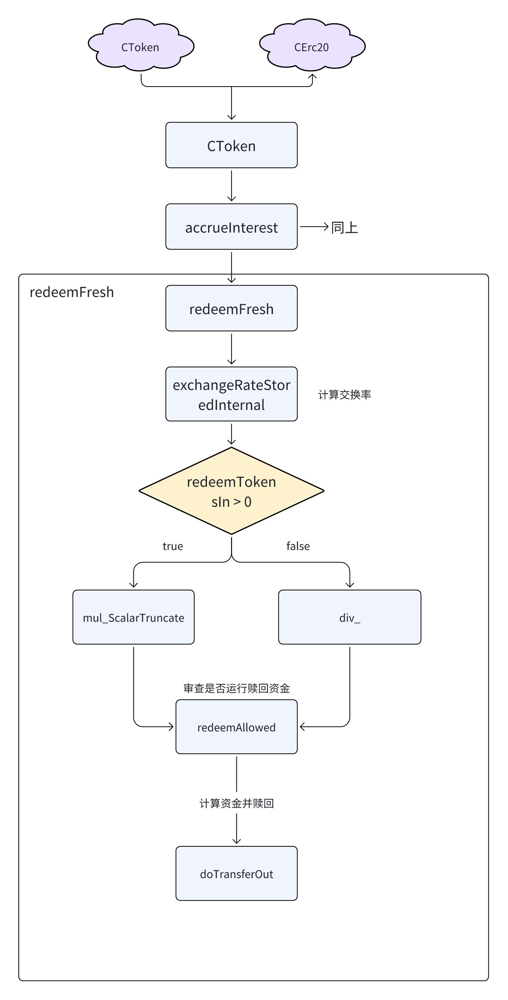

# Compound 借贷协议原理与源码解读

# 一. Compound 协议概述

Compound 是一个去中心化的借贷协议，运行在以太坊区块链上，允许用户借出或借入加密资产，并赚取或支付利息。作为 DeFi 领域的代表性项目之一，Compound 通过智能合约来管理用户的资产和交易，从而消除了传统金融中介的作用。

## 1.核心概念

**1.1. cToken**

- 当用户将资产存入 Compound 时，他们会收到相应的 cToken（例如，存入 ETH 会收到 cETH）。
- cToken 代表用户在 Compound 中的存款及其产生的利息。
- cToken 可以赎回为其代表的原始资产及其利息。

**1.2.供给与借贷**

- **供给**: 用户可以将自己的加密资产（如 ETH、USDC、DAI 等）存入 Compound 协议，从而开始赚取利息。
- **借贷**: 用户可以使用他们存入的资产作为抵押，从协议中借出其他资产。借款人需要支付利息，而这些利息将分发给供应者。

**1.3. 利率模型**

- 利率是动态调整的，基于资产的市场供需情况。
- 每个市场（如 ETH、DAI 等）都有一个单独的利率模型，决定了供给利率和借贷利率。

**1.4. 抵押品与清算**

- 借款人必须提供超额抵押品，即借款价值必须小于抵押品的价值。
- 如果借款人的抵押品价值跌破清算阈值，清算人可以部分或全部收回抵押品以偿还债务。

## 2.核心功能

**2.1. 供给资产**

- 用户可以将资产存入 Compound 协议，开始赚取利息。存入资产的用户会收到相应的 cToken。
- 这些 cToken 可以随时赎回为底层资产，赎回时会包括存款期间累计的利息。

**2.2. 借贷资产**

- 用户可以使用他们存入的资产作为抵押，从 Compound 协议中借出其他资产。
- 借款的利息是根据借贷市场的利率模型动态确定的。
- 借款人必须维持足够的抵押品以避免清算。

**2.3. 清算机制**

- 如果借款人的抵押品价值下跌到一定比例（清算阈值）以下，清算人可以触发清算过程。
- 在清算过程中，部分或全部抵押品将被出售以偿还债务。

**2.4.工作流程**

*2.4.1.存款流程*

- 用户将资产存入 Compound 协议。
- 系统根据当前的利率将资产转换为 cToken 并发放给用户。

*2.4.2.借款流程*

- 用户选择要借的资产并确认借款。
- 系统计算用户可借额度，并要求用户提供足够的抵押品。
- 用户支付利息，利息动态调整。

*2.4.3.清算流程*

- 当借款人的抵押品价值不足时，清算人可以发起清算。
- 系统会将部分抵押品出售给清算人，以偿还用户的债务。

## 3.Compound 的治理

Compound 协议通过治理代币 COMP 实现去中心化治理。COMP 持有者可以提议、投票和执行对协议的更改，包括利率模型的调整、新资产的引入等。

- **提案**: 任何持有一定数量 COMP 代币的用户可以提出治理提案。
- **投票**: 所有 COMP 持有者都可以对提案进行投票。
- **执行**: 当提案获得足够的投票支持后，系统会自动执行提案。

# 二. Compound 协议涉及的算法

## 1.资金利用率 (Utilization Rate, U)

资金利用率是决定借贷利率的关键参数，表示市场中借出的资产占总供应资产的比例。计算公式为：

U = Total Borrows/(Total Cash + Total Borrows - Reserves)

- Total Borrows: 当前市场中已被借出的资产总量。
- Total Cash: 市场中未借出的剩余资产（流动性）。
- Reserves: 协议中的储备金，通常是保留的一部分利息收入。

借贷利率 (Borrow Rate)

借贷利率是借款人需支付的年化利率，基于资金利用率计算。

## 2.利率模型

Compound 使用多种利率模型，其中最常用的是**跳跃利率模型**。该模型在资金利用率较低时，利率增长较慢，但当利用率达到一定阈值后，利率增长会加快。

2.1.跳跃利率模型的公式

跳跃利率模型的公式分为两段，根据资金利用率 U  是否超过一个设定的阈值（称为 “Kink”）来计算利率
```
If U <= Kink 

    Borrow Rate = Base Rate + U + Multiplier_low 

If U > Kink 

    Borrow Rate = Base Rate + U + Multiplier_low + (U - Kink) x Multiplier_high
```
- Base Rate: 基础利率，即最低利率。
- Multiplier_low: 低于 Kink 时的利率增长系数。
- Multiplier_high: 高于 Kink 时的利率增长系数。
- Kink: 资金利用率的阈值，当利用率超过此值时，利率增长加速。

## 3.供给利率的计算

供给利率（Supply Rate）是供应者能获得的年化利率，它依赖于借贷利率和资金利用率。计算公式为：

Supply Rate=U × Borrow Rate × (1−Reserve Factor)

- **Reserve Factor**: 储备因子，表示协议保留的一部分利息收入，不分配给供应者。

# 三. Compound 核心代码

## 1.合约架构

Compound 协议的核心合约包括：

- Comptroller: 协议的核心控制器，管理市场和用户交互。
- cToken 合约: 代表用户存款的 ERC20 代币，每个支持的资产都有一个相应的 cToken 合约（如 cETH、cDAI）。
- Interest Rate Model 合约: 负责计算市场的借贷利率。
- Price Oracle: 提供资产的价格信息。
- Compound Governance 合约: 管理协议的治理功能，使用 COMP 代币。

## 2.Comptroller 合约

Comptroller 是 Compound 协议的主控合约，负责管理市场的加入和退出、利率的设置、清算流程等。它是整个协议的中枢，负责协调各个 cToken 合约和其他辅助合约。

2.1.核心功能

- 市场管理: Comptroller 维护一个市场列表，其中包含所有受支持的资产（cToken）。
- 用户操作管理: 当用户在 Compound 中存入或借出资产时，Comptroller 会检查是否满足条件，并执行相关逻辑。
- 清算逻辑: 监控用户的借款情况，当抵押品价值不足时，允许清算人进行清算。
- 安全检查: 实施各种安全检查（如账户的健康度），确保用户和系统的安全性。

2.2.关键函数

- enterMarkets(address[] cTokens): 用户将他们的资产存入多个市场（cToken）。
- exitMarket(address cToken): 用户退出某个市场。
- getAccountLiquidity(address account): 计算用户账户的流动性，确保借款不会超过允许的限额。
- liquidateBorrow(address borrower, uint repayAmount, address cTokenCollateral): 清算借款人，归还债务并获取抵押品。

## 3.cToken 合约

cToken 合约是 ERC20 标准的扩展，每种支持的资产在 Compound 中都有一个对应的 cToken 合约。cToken 记录用户在 Compound 中的存款，并通过利息累积机制增加用户的余额。

3.1.核心功能

- 铸造和赎回: 用户存入原始资产时，cToken 合约会铸造相应数量的 cToken，用户可以随时赎回原始资产。
- 利息计算: cToken 合约根据市场的利率模型定期计算利息，并将其添加到用户的余额中。
- 借贷和还款: 用户可以借出和归还资产，cToken 合约管理用户的借贷头寸，并计算应支付的利息。

3.2.关键函数

- mint(uint mintAmount): 用户存入资产，并获得相应的 cToken。
- redeem(uint redeemTokens): 用户赎回资产，销毁相应数量的 cToken。
- borrow(uint borrowAmount): 用户借出资产，增加债务。
- repayBorrow(uint repayAmount): 用户还款，减少债务。
- accrueInterest(): 计算并累积利息。

## 4.Interest Rate Model 合约

每个市场的利率是动态调整的，由 Interest Rate Model 合约计算。该模型通常根据市场的借贷比率（借出的资产与总供应量的比率）来确定利率。

4.1.核心功能

- 借贷利率计算: 根据市场供需关系动态计算借贷利率。
- 利率更新: 利率模型可以根据新的市场数据进行更新，以保持市场的稳定性和竞争力。

4.2.关键函数

- getBorrowRate(uint cash, uint borrows, uint reserves): 根据市场的当前现金、借款和储备情况，计算借款利率。
- getSupplyRate(uint cash, uint borrows, uint reserves, uint reserveFactor): 计算供应者的利率。

## 5.Price Oracle 合约

Price Oracle 合约为 Compound 提供资产的价格数据，确保借贷和清算过程中的资产估值准确。这个合约可以集成外部预言机（如 Chainlink）以获取实时价格。

5.1.核心功能

- 价格获取: 获取各个资产的当前市场价格。
- 价格更新: 定期更新价格数据，以反映市场的变化。

5.2.关键函数

- getUnderlyingPrice(address cToken): 获取特定 cToken 对应资产的价格。
- setUnderlyingPrice(address cToken, uint price): 手动设置资产价格（在某些情况下使用）。

## 6.Compound Governance 合约

治理合约允许 COMP 代币持有者对 Compound 协议的参数和功能进行投票。治理合约管理提案的创建、投票和执行。

6.1.核心功能

- **提案管理**: COMP 持有者可以提出对协议的更改提案。
- **投票机制**: COMP 持有者根据其持有的代币数量对提案进行投票。
- **提案执行**: 当提案通过后，治理合约会自动执行相关更改。

6.2.关键函数

- propose(address[] targets, uint[] values, string[] signatures, bytes[] calldatas, string description): 创建提案。
- castVote(uint proposalId, bool support): 对提案进行投票。
- execute(uint proposalId): 执行通过的提案。

# 四. Compound 代码执行流程

## 1.用户存款


## 2.用户赎回资产



## 3.借出流程


## 4.归还借款流程


## 5.清算流程


- 清算人一般会运行一个链下服务，监听链上的数据状态，帮借款人进行清算，清算服务确保 Compound 协议能够维持整体健康，并防止因市场波动造成系统性风险。

# 五. 总结

**Compound** 是一个去中心化的借贷协议，允许用户在区块链上存入加密资产赚取利息，或者抵押资产借款。以下是 Compound 的核心功能和特点总结：

- **去中心化借贷平台**：用户可以将加密资产存入 Compound 赚取利息，或抵押资产借款，整个过程通过智能合约实现，无需中介。
- **利率算法**：利率是动态的，由供需关系决定。当某种资产的需求增加时，利率会上升，反之则下降。
- **cToken**：存入资产的用户会收到 cToken（如 cETH、cDAI），这些代币代表用户在 Compound 中的存款，且随着时间自动累积利息。
- **超额抵押机制**：借款需要超额抵押，即用户必须存入高于借款金额的资产作为抵押品，以确保系统的安全性。
- **清算机制**：如果借款人的抵押品价值跌破一定阈值，清算人可以部分偿还借款人的债务，并获得他们的抵押品作为奖励，保障协议安全。
- **去中心化治理**：COMP 代币持有者可以对协议的变更进行投票和治理，影响利率模型、市场参数等方面。

Compound 协议为加密用户提供了一种无需信任第三方即可参与借贷市场的方式，同时利用去中心化治理和动态利率模型保持系统的长期稳定。