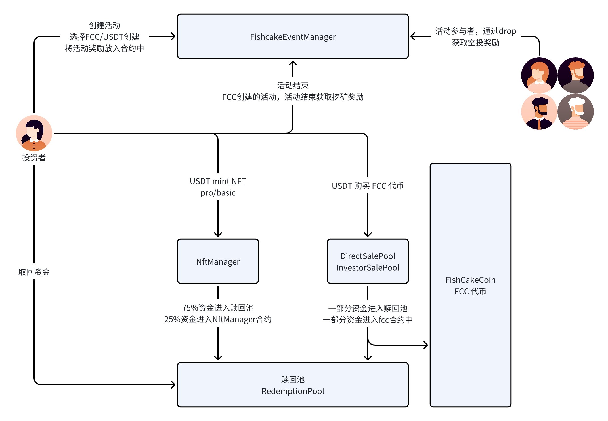
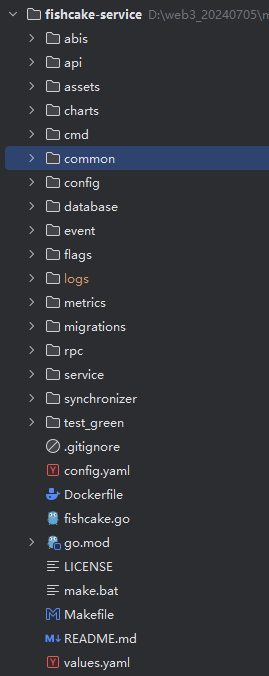
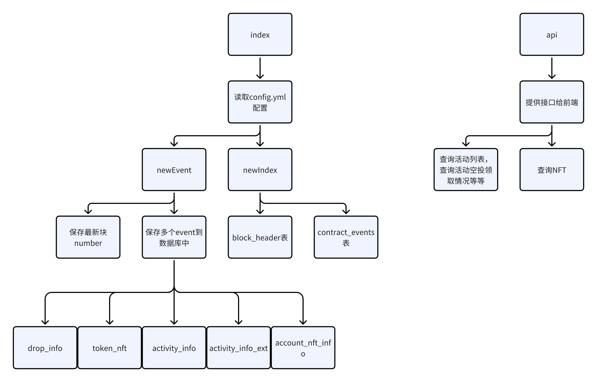

# EventFi 项目 Fishcacke 源码解析

# 一.开源代码与资料链接

- Github: https://github.com/FishcakeLab

- 产品资料: https://github.com/FishcakeLab/Fishcake-Tokenomics

- 代币经济学: https://github.com/FishcakeLab/Fishcake-Tokenomics/blob/main/Fishcake%20EventFi%20Tokenomic%20Whitepaper.pdf

- NFT产品：: https://github.com/FishcakeLab/Fishcake-Tokenomics/blob/main/NFT%20PASS%20.pdf

- 链上合约：https://github.com/FishcakeLab/fishcake-contracts

- 链下服务： https://github.com/FishcakeLab/fishcake-service


# 二.项目相关名词解释

## 1.**Fishcake Coin ：FCC 官方发行的代币**

- 合约代码：FishCakeCoin.sol

## 2.直接销售代币

- 合约代码：DirectSalePool.sol
- 直接销售的比例是，1个usdt = 10个FCC

## 3.投资者销售代币

- InvestorSalePool.sol
- 如果投资者大额购买，比例是阶梯制的，详情看合约代码

## 4.NFT mint

- NftManager.sol
- nft分为 pro 和 basic，分别有不同的权限，在创建活动和活动完成时，有不同的处理。

## 5.赎回池

- 合约代码：RedemptionPool.sol
- usdt通过购买fcc和mint nft，一部分资金会进入赎回池，股东可以取回花费的资金。

## 6.活动创建 与 挖矿

- FishcakeEventManager.sol
- 利用 Fishcake Coin （FCC） 或 USDT 参与和创建营销活动。

# 三.合约逻辑流程与代码讲解

## 1.合约逻辑流程图



- 第一步，mint NFT，使用USDT进行交易，可以获取NFT和FCC代币
- 第二步，创建活动，使用USDT/FCC作为风投奖励，可以创建一个新的活动
- 第三步，活动发起人，单个的发放空投给参与者
- 第四步，活动结束，如果是FCC创建的活动，那么可以获取到挖矿奖励

其他

- 使用usdt获取FCC代币
- 项目结束，从赎回池中获取自己投资的USDT

## 2.合约代码讲解

**2.1.FishCakeCoin.sol FCC 代币合约**

```solidity
struct fishCakePool {
    // FishcakeEventManager
    address  miningPool;
    // DirectSalePool
    address  directSalePool;
    // InvestorSalePool
    address  investorSalePool;
    // NftManager
    address  nftSalesRewardsPool;
    address  ecosystemPool;
    address  foundationPool;
    // redemptionPool
    address  redemptionPool;
}

contract FishCakeCoin {
    // 设置参数
    function setPoolAddress(fishCakePool memory _pool) external onlyOwner {
        _beforeAllocation();
        _beforePoolAddress(_pool);
        fcPool = _pool;
    }
    // 为池子初始化代币
    function poolAllocate() external onlyOwner {
        _beforeAllocation();
        _mint(fcPool.miningPool, (MaxTotalSupply * 3) / 10); // 30% of total supply
        _mint(fcPool.directSalePool, (MaxTotalSupply * 2) / 10); // 20% of total supply
        _mint(fcPool.investorSalePool, MaxTotalSupply / 10); // 10% of total supply
        _mint(fcPool.nftSalesRewardsPool, (MaxTotalSupply * 2) / 10); // 20% of total supply
        _mint(fcPool.ecosystemPool, MaxTotalSupply / 10);  // 10% of total supply
        _mint(fcPool.foundationPool, MaxTotalSupply / 10); // 10% of total supply
        isAllocation = true;
    }
}
```

**2.2.DirectSalePool.sol 直接销售代币**

```solidity
contract DirectSalePool {
    function buyFccAmount(uint256 fccAmount) external {
        require(fishCakeCoin.balanceOf(address(this)) >= fccAmount, "DirectSalePool buyFccAmount: fcc token is not enough");
        // 计算购买的FCC需要多少USDT
        uint256 payUsdtAmount = fccAmount / 10;
        if (tokenUsdtAddress.balanceOf(msg.sender) < payUsdtAmount) {
            revert TokenUsdtBalanceNotEnough();
        }
        
        totalSellFccAmount += fccAmount;
        totalReceiveUsdtAmount += payUsdtAmount;
        // 将usdt转入赎回池
        tokenUsdtAddress.transferFrom(msg.sender, address(redemptionPool), payUsdtAmount);
        // 将FCC代币转给调用者
        fishCakeCoin.transfer(msg.sender, fccAmount);
    
        emit BuyFishcakeCoin(msg.sender, payUsdtAmount, fccAmount);
    }
    

}
```

**2.3.InvestorSalePool.sol 投资者销售代币**

```solidity
contract InvestorSalePool {
    function buyFccAmount(uint256 fccAmount) external {
        if (fccAmount > fishCakeCoin.balanceOf(address(this))) {
            revert FccTokenAmountNotEnough();
        }
        // 根据需要购买的fcc代币数量，进行计算，，购买者是大额购买，还是小额
        uint256 tokenUsdtAmount = calculateUsdtByFcc(fccAmount);
        if (tokenUsdtAddress.balanceOf(msg.sender) < tokenUsdtAmount) {
            revert TokenUsdtAmountNotEnough();
        }
        totalSellFccAmount += fccAmount;
        totalReceiveUsdtAmount += tokenUsdtAmount;
        // 将一半资金转入到当前合约
        tokenUsdtAddress.transferFrom(msg.sender, address(this), tokenUsdtAmount / 2);
        // 将一般资金转入到赎回池
        tokenUsdtAddress.transferFrom(msg.sender, address(redemptionPool), tokenUsdtAmount / 2);
        // 将FCC代币转给调用者
        fishCakeCoin.transfer(msg.sender, fccAmount);
    
        emit BuyFishcakeCoin(msg.sender, tokenUsdtAmount, fccAmount);
    }
    
    // 根据需要购买的fcc代币数量，进行计算，，购买者是大额购买，还是小额
    function calculateUsdtByFcc(uint256 _amount) internal pure returns (uint256) {
        if (_amount >= 5_000_000 * fccDecimal) {
            return (_amount * usdtDecimal) / (fccDecimal * 50); // 1 FCC = 0.02 USDT
        } else if(_amount < 5_000_000 * fccDecimal && _amount >= 250_000 * fccDecimal) {
            return (_amount * usdtDecimal) / (fccDecimal * 25); // 1 FCC = 0.04 USDT
        } else if (_amount < 250_000 * fccDecimal && _amount >= 100_000 * fccDecimal) {
            return (_amount * usdtDecimal) / (fccDecimal * 20); // 1 FCC = 0.05 USDT
        } else if (_amount < 100_000 * fccDecimal && _amount >= 16_666 * fccDecimal) {
            return (_amount * usdtDecimal) / (fccDecimal * 16); // 1 FCC = 0.06 USDT
        } else {
            revert NotSupportFccAmount();
        }
    }
}
```

**2.4.NftManager.sol**

```solidity
function createNFT(
    string memory _businessName,
    string memory _description,
    string memory _imgUrl,
    string memory _businessAddress,
    string memory _website,
    string memory _social,
    uint8 _type
) external nonReentrant returns (bool, uint256) {
    // 区分mint的是 pro，还是 basic
    require(_type == 1 || _type == 2, "NftManager createNFT: type can only equal 1 and 2, 1 stand for merchant, 2 stand for personal user");
    // pro需要 80 USDT，basic需要 8 USDT
    uint256 payUsdtAmount = _type == 1 ? merchantValue : userValue;
    uint256 nftDeadline = block.timestamp + validTime;
    
    if( _type == 1) {
        require(tokenUsdtAddr.allowance(msg.sender, address(this)) >= merchantValue, "NftManager createNFT: Merchant allowance must more than 80 U");
        // 在mapping中记录调用人有pro权限
        merchantNftDeadline[msg.sender] = nftDeadline;
        // 转FCC给调用者
        fccTokenAddr.transfer(msg.sender, proMineAmt);
    } else {
        require(tokenUsdtAddr.allowance(msg.sender, address(this)) >= userValue, "NftManager createNFT: Merchant allowance must more than 8 U");
        userNftDeadline[msg.sender] = nftDeadline;
        fccTokenAddr.transfer(msg.sender, basicMineAmt);
    }
    
    // 将usdt转入到当前合约
    tokenUsdtAddr.transferFrom(msg.sender, address(this), payUsdtAmount);
    // 将75%的USDT转入到赎回池
    tokenUsdtAddr.transfer(address(redemptionPoolAddress), (payUsdtAmount * 75) / 100);
    // mint nft
    _mint(msg.sender, tokenId);

    return (true, tokenId);
}
```

**2.5.FishcakeEventManager.sol**

- 活动创建

```solidity
function activityAdd(
    string memory _businessName,
    string memory _activityContent,
    string memory _latitudeLongitude,
    uint256 _activityDeadLine,
    uint256 _totalDropAmts,
    uint8 _dropType,
    uint256 _dropNumber,
    uint256 _minDropAmt,
    uint256 _maxDropAmt,
    address _tokenContractAddr
) public nonReentrant returns (bool, uint256) {
    // 创建时可以随机奖励，还是固定奖励
    require(_dropType == 2 || _dropType == 1, "FishcakeEventManager activityAdd: Drop Type Error.");
    // 随机奖励时，最大奖励不能大于最小奖励
    require(_maxDropAmt >= _minDropAmt, "FishcakeEventManager activityAdd: MaxDropAmt Setup Error.");
    // 总份数
    require(_totalDropAmts > 0, "FishcakeEventManager activityAdd: Drop Amount Error.");
    // 活动结束时间，活动开始时间
    require(
        block.timestamp < _activityDeadLine &&
        _activityDeadLine < block.timestamp + maxDeadLine,
        "FishcakeEventManager activityAdd: Activity DeadLine Error."
    );
    // 总金额 = 最大奖励 * 奖励次数
    require(_totalDropAmts == _maxDropAmt * _dropNumber, "FishcakeEventManager activityAdd: Drop Number Not Meet Total Drop Amounts.");
    // 总奖励不能太多
    require(_totalDropAmts >= 10e5, "FishcakeEventManager activityAdd: Total Drop Amounts Too Little , Minimum of 1.");
    // 奖励次数限制
    require(_dropNumber <= 101 || _dropNumber <= _totalDropAmts / 10e6, "FishcakeEventManager activityAdd: Drop Number Too Large ,Limt 100 or TotalDropAmts/10.");
    // 活动创建时，发放空投必须时USDT，或者，FCC token
    require(_tokenContractAddr == address(UsdtTokenAddr) || _tokenContractAddr == address(FccTokenAddr), "FishcakeEventManager activityAdd: Token contract address error");

    if(_dropType==1){
        _minDropAmt=0;
    }

    // 活动创建，将空投数目转入合约中
    IERC20(_tokenContractAddr).transferFrom(msg.sender, address(this), _totalDropAmts);

    ActivityInfo memory ai = ActivityInfo({
        activityId: activityInfoArrs.length + 1,
        businessAccount: msg.sender,
        businessName: _businessName,
        activityContent: _activityContent,
        latitudeLongitude: _latitudeLongitude,
        activityCreateTime: block.timestamp,
        activityDeadLine: _activityDeadLine,
        dropType: _dropType,
        dropNumber: _dropNumber,
        minDropAmt: _minDropAmt,
        maxDropAmt: _maxDropAmt,
        tokenContractAddr: _tokenContractAddr
    });
    
    ActivityInfoExt memory aie = ActivityInfoExt({
        activityId: activityInfoArrs.length + 1,
        alreadyDropAmts: 0,
        alreadyDropNumber: 0,
        businessMinedAmt: 0,
        businessMinedWithdrawedAmt: 0,
        activityStatus: 1
    });
    
    activityInfoArrs.push(ai);
    activityInfoExtArrs.push(aie);

    return(true, ai.activityId);
}
```

- 发放空投

```solidity
function drop(uint256 _activityId, address _userAccount, uint256 _dropAmt) external nonReentrant returns (bool) {
    // 不允许重复获取空投
    require(activityDropedToAccount[_activityId][_userAccount] == false, "FishcakeEventManager drop: User Has Droped.");

    // 将活动创建时的信息，获取到
    ActivityInfo storage ai = activityInfoArrs[_activityId - 1];
    ActivityInfoExt storage aie = activityInfoExtArrs[_activityId - 1];
    
    require(aie.activityStatus == 1, "FishcakeEventManager drop: Activity Status Error.");
    // 必须是活动发起人，才可以发放空投
    require(ai.businessAccount == msg.sender, "FishcakeEventManager drop: Not The Owner.");
    // 活动未结束
    require(ai.activityDeadLine>= block.timestamp, "FishcakeEventManager drop: Activity Has Expired.");

    if (ai.dropType == 2) {
        require(_dropAmt <= ai.maxDropAmt && _dropAmt >= ai.minDropAmt, "FishcakeEventManager drop: Drop Amount Error.");
    } else {
        _dropAmt = ai.maxDropAmt;
    }

    require(ai.dropNumber > aie.alreadyDropNumber, "FishcakeEventManager drop: Exceeded the number of rewards.");
    require(ai.maxDropAmt * ai.dropNumber >= _dropAmt + aie.alreadyDropAmts, "FishcakeEventManager drop: The reward amount has been exceeded.");

    // 发放空投
    IERC20(ai.tokenContractAddr).transfer(_userAccount, _dropAmt);
    // 已发放空投
    activityDropedToAccount[_activityId][_userAccount] = true;

    aie.alreadyDropAmts += _dropAmt;
    aie.alreadyDropNumber++;
    
    return true;
}
```

- 活动完成

```solidity
function activityFinish(uint256 _activityId) public nonReentrant returns (bool) {
    ActivityInfo storage ai = activityInfoArrs[_activityId - 1];
    ActivityInfoExt storage aie = activityInfoExtArrs[_activityId - 1];

    require(ai.businessAccount == msg.sender, "FishcakeEventManager activityFinish: Not The Owner.");
    require(aie.activityStatus == 1, "FishcakeEventManager activityFinish: Activity Status Error.");
    // 活动状态修改
    aie.activityStatus = 2;
    uint256 returnAmount = ai.maxDropAmt * ai.dropNumber - aie.alreadyDropAmts;

    uint256 minedAmount = 0;
    if (returnAmount > 0 ) {
        // 将剩余资金转给调用者，也就是活动发起人
        IERC20(ai.tokenContractAddr).transfer(msg.sender, returnAmount);
    }

    //ifReward There is only one reward in 24 hours
    // 如果mint了NFT，不管是pro还是basic，并且NFT未过期
    if ( isMint && ifReward() && iNFTManager.getMerchantNTFDeadline(_msgSender()) > block.timestamp || iNFTManager.getUserNTFDeadline(_msgSender()) > block.timestamp ) {
        //Get the current percentage of mined tokens
        uint8 currentMinePercent = getCurrentMinePercent();
        if (minePercent != currentMinePercent) {
            minePercent = currentMinePercent;
        }
        // 并且创建活动时，是选择的FCC token活动
        if ( minePercent > 0 && address(FccTokenAddr) == ai.tokenContractAddr) {
            uint8 percent = (
                iNFTManager.getMerchantNTFDeadline(_msgSender()) > block.timestamp ? minePercent : minePercent / 2
            );
            uint256 maxMineAmtLimt = (
                iNFTManager.getMerchantNTFDeadline(_msgSender()) > block.timestamp ? merchantOnceMaxMineAmt : userOnceMaxMineAmt
            );
            // For each FCC release activity hosted on the platform, the activity initiator can mine tokens based on either 50% of the total token quantity consumed by the activity or 50% of the total number of participants multiplied by 20, whichever is lower.
            // 获取挖矿奖励
            // 获取挖矿奖励
            // 获取挖矿奖励
            uint256 tmpDropedVal = aie.alreadyDropNumber * 20 * 1e6;
            uint256 tmpBusinessMinedAmt = ((aie.alreadyDropAmts > tmpDropedVal ? tmpDropedVal : aie.alreadyDropAmts) * percent) / 100;
            if (tmpBusinessMinedAmt > maxMineAmtLimt) {
                tmpBusinessMinedAmt = maxMineAmtLimt;
            }
            if(totalMineAmt > minedAmt){
                if (totalMineAmt > minedAmt + tmpBusinessMinedAmt) {
                    aie.businessMinedAmt = tmpBusinessMinedAmt;
                    minedAmt += tmpBusinessMinedAmt;
                    FccTokenAddr.transfer(msg.sender, tmpBusinessMinedAmt);
                    minedAmount = tmpBusinessMinedAmt;
                } else {
                    aie.businessMinedAmt = totalMineAmt - minedAmt;
                    minedAmt += aie.businessMinedAmt;
                    FccTokenAddr.transfer(msg.sender, aie.businessMinedAmt);
                    minedAmount = aie.businessMinedAmt;
                    isMint = false;
                }
                NTFLastMineTime[msg.sender] =block.timestamp;
            }
        }
    }

    activityInfoChangedIdx.push(_activityId - 1);

    return true;
}
```

# 四.链下服务

## 1.链下项目逻辑流程图



- abis：合约代码编译后的abi文件
- api：给前端提供接口数据返回，查询service的方法
- cmd：服务启动
- common，config：配置项
- database：数据库查询
- event：从abi生成代码，解析块/tx/log数据
- flags：启动参数
- rpc：调用外部接口
- service：从DB获取数据，从链上获取数据，提供给api访问
- synchronizer：从链上获取块/tx/log数据，保存到数据库中



- 第一步，启动index扫链服务，主要是读取配置，然后扫块获取event信息，分类后推送到各个数据库中
- 第二步，启动api后端服务，查询分类后的event数据，进行整理返回给前端

## 2.链下代码讲解

- fishcacke.go

```go
func NewIndex(ctx *cli.Context, cfg *config.Config, db *database.DB, shutdown context.CancelCauseFunc) *FishCake {
    f := &FishCake{}
    f.newIndex(ctx, cfg, db, shutdown)
    f.newEvent(cfg, db, shutdown)
    return f
}
```

- newIndex

```go
syncer, _ := synchronizer.NewSynchronizer(cfg, syncConfig, db, client, shutdown)
err := syncer.Start()
```

- Index start

```go
获取一批区块
newHeaders, err := syncer.headerTraversal.NextHeaders(syncer.headerBufferSize)
保存到数据库中
err := syncer.processBatch(syncer.headers, syncer.ymlCfg)
```

- processBatch

```go
retryStrategy := &retry.ExponentialStrategy{Min: 1000, Max: 20_000, MaxJitter: 250}
if _, err := retry.Do[interface{}](syncer.resourceCtx, 10, retryStrategy, func() (interface{}, error) {
    // 启动事务
    if err := syncer.db.Transaction(func(tx *database.DB) error {
       // 保存block
       if err := tx.Blocks.StoreBlockHeaders(blockHeaders); err != nil {
          return err
       }
       // 保存event
       if err := tx.ContractEvent.StoreContractEvents(chainContractEvent); err != nil {
          return err
       }
       return nil
    }); err != nil {
       log.Println("unable to persist batch", err)
       return nil, fmt.Errorf("unable to persist batch: %w", err)
    }
    return nil, nil
}); err != nil {
    return err
}
```

- newEvent

```go
func (f *FishCake) newEvent(cfg *config.Config, db *database.DB, shutdown context.CancelCauseFunc) error {
    var epoch uint64 = 10_000
    var loopInterval time.Duration = time.Second * 2
    eventProcessor, _ := polygon.NewEventProcessor(db, loopInterval, cfg.Contracts,
       cfg.StartBlock, cfg.EventStartBlock, epoch, shutdown, cfg.AliConfig)
    err := eventProcessor.Start()
    if err != nil {
       log.Println("failed to start eventProcessor:", err)
       return err
    }
    return nil
}
```

- Event Start

```go
err := pp.onData()
```

- onData

```go
if err := pp.db.Transaction(func(tx *database.DB) error {
    // 处理event
    eventsFetchErr := pp.eventsFetch(fromHeight, toHeight)
    if eventsFetchErr != nil {
       return eventsFetchErr
    }
    lastBlock := block_listener.BlockListener{
       BlockNumber: toHeight,
    }
    // 保存或者更新最大区块
    updateErr := pp.db.BlockListener.SaveOrUpdateLastBlockNumber(lastBlock)
    if updateErr != nil {
       log.Println("update last block err :", updateErr)
       return updateErr
    }
    return nil
}); err != nil {
    pp.startHeight = new(big.Int).Sub(pp.startHeight, bigint.One)
    return err
}
```

- eventsFetch

```go
func (pp *PolygonEventProcessor) eventsFetch(fromHeight, toHeight *big.Int) error {
    contracts := pp.contracts
    for _, contract := range contracts {
       // 查询数据库中的数据
       contractEventFilter := event.ContractEvent{ContractAddress: common.HexToAddress(contract)}
       events, err := pp.db.ContractEvent.ContractEventsWithFilter(contractEventFilter, fromHeight, toHeight)
       if err != nil {
          log.Println("failed to index ContractEventsWithFilter ", "err", err)
          return err
       }
       for _, contractEvent := range events {
          // 数据分类处理
          unpackErr := pp.eventUnpack(contractEvent)
          if unpackErr != nil {
             log.Println("failed to index events", "unpackErr", unpackErr)
             return unpackErr
          }
       }
    }
    return nil
}
```

- eventUnpack

```go
func (pp *PolygonEventProcessor) eventUnpack(event event.ContractEvent) error {
    merchantAbi, _ := abi.FishcakeEventManagerMetaData.GetAbi()
    nftTokenAbi, _ := abi.NftManagerMetaData.GetAbi()
    switch event.EventSignature.String() {
    // 数据分类后，保存到数据库
    case merchantAbi.Events["ActivityAdd"].ID.String():
       err := unpack.ActivityAdd(event, pp.db)
       return err
    case merchantAbi.Events["ActivityFinish"].ID.String():
       err := unpack.ActivityFinish(event, pp.db)
       return err
    case nftTokenAbi.Events["CreateNFT"].ID.String():
       err := unpack.MintNft(event, pp.db)
       return err
    case merchantAbi.Events["Drop"].ID.String():
       err := unpack.Drop(event, pp.db)
       return err
    }
    return nil
}
```

- web api service

这里比较简单，我们就不说了

# 五. 小结

本文讲解了 EventFi 项目 FishCake 的代码细节，如果你要了解更多 FishCake 项目相关的信息，可以看[这篇文章](../practical_project/The%20Web3%20FishCake.md)