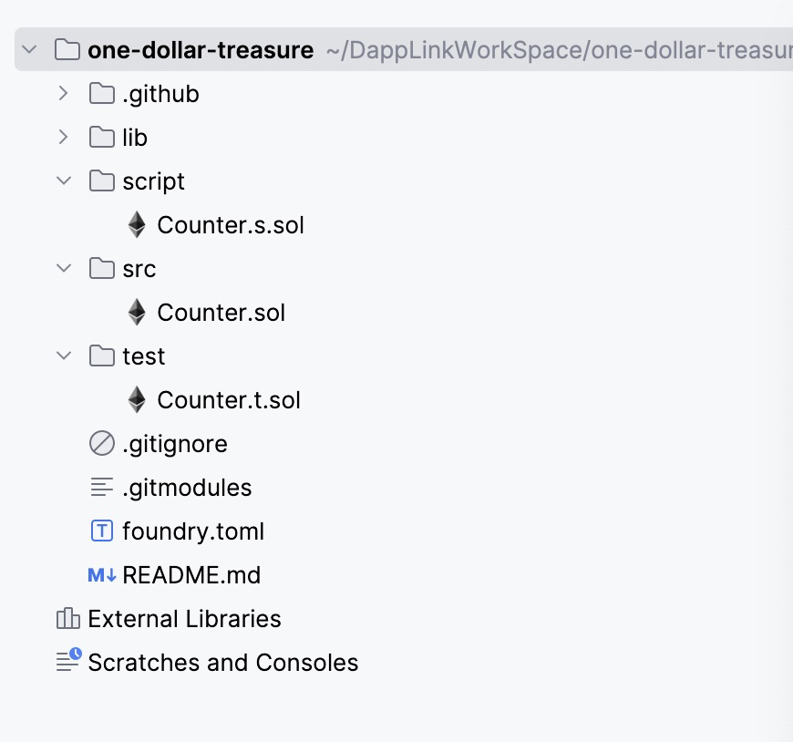
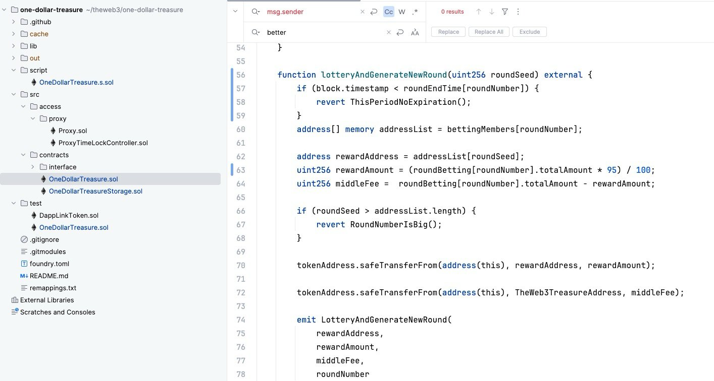

# Ethereum 开发工具之 Foundry 

# 一. Foundy 简介

Foundry是一套专为以太坊智能合约开发而设计的工具链，旨在提升开发者的工作效率和开发体验。Foundry提供了一系列功能强大的工具，支持快速的合约编写、测试、部署和调试。以下是Foundry合约开发工具的主要组成部分和功能介绍：

## 1.主要组成部分

1.1.**Forge**

- **Forge是Foundry的核心工具**，用于编译、测试和部署智能合约。
- 它支持Solidity和Yul语言，提供了高效的编译器，并与EVM（以太坊虚拟机）紧密集成。
- Forge允许开发者轻松运行单元测试、覆盖率测试和模拟测试环境。

1.2.**Cast**

- **Cast是Foundry的命令行工具**，用于与以太坊区块链进行交互。
- 它支持常见的区块链操作，例如查询区块、交易、账户余额和发送交易。
- Cast还支持脚本编写，帮助开发者自动化重复的区块链交互操作。

1.3.**Anvil**

- **Anvil是Foundry的本地开发节点**，用于模拟以太坊网络环境。
- 它提供了一个轻量级的本地测试网络，支持快速的合约部署和测试。
- Anvil允许开发者在本地调试合约，方便快速迭代和调整。

## 2.功能介绍

2.1.**高效的编译器**：

- Foundry的编译器优化了合约的编译速度和生成的字节码质量。
- 支持Solidity和Yul，兼容主流的Solidity版本。

2.2.**强大的测试框架**：

- Forge提供了全面的测试功能，包括单元测试、集成测试和覆盖率测试。
- 测试框架支持断言和模拟，帮助开发者验证合约逻辑的正确性。

2.3.**调试和分析工具**：

- Foundry包含强大的调试功能，支持断点、变量监视和交易回溯。
- 开发者可以深入分析合约执行过程，找出潜在的问题和性能瓶颈。

2.4.**便捷的部署和管理**：

- Forge支持一键部署合约到本地或远程的以太坊网络。
- 开发者可以轻松管理多个部署环境和合约版本。

2.5.**脚本和自动化**：

- Cast工具支持编写脚本，自动化常见的区块链交互任务。
- 支持复杂的脚本逻辑，帮助开发者提高工作效率。

# 二.安装与简单命令

**安装：**Foundry可以通过命令行工具安装，首先需要安装Rust，然后通过Cargo 安装 Foundry：

```bash
curl -L https://foundry.paradigm.xyz | bash
foundryup
```

**初始化项目**：创建新的Foundry项目：

```
forge init your-project
```

**编译合约**：编译 Solidity 合约：

```
forge build
```

**运行测试**：运行测试用例：

```
forge test
```

**部署合约**

```
forge script script/xxx.s.sol:xxxScript --rpc-url <your_rpc_url> --private-key <your_private_key>
```

**验证合约：**步骤分为生成验证数据和执行验证命令

- 设置 EtherScan API Key

```
export ETHERSCAN_API_KEY=G2KQYXZEAV4H3GB1A1T6N832412D4648KH
```

- 执行验证命令

```
forge verify-contract --chain-id 11155111 0x599a22f498e5e0000440860ee4ff1dd8a5f06b66 src/contracts/OneDollarTreasure.sol:OneDollarTreasure
```

**与区块链交互**：使用Cast与区块链交互：

```
cast send --from <address> <contract-address> <method> <args>
```

# 三. 使用 Foundry 工具开发上线一元夺宝游戏

## 1.初始化项目

- 执行初始化项目命令

```
forge init one-dollar-treasure
```

- 生成代码结构如下



- lib目录：lib 目录下放置的是各种第三方的依赖库，例如 OZ 代码库
- script 目录：放置部署脚本的目录
- Src 目录：放置合约项目核心代码的目录
- Test 目录：放置测试脚本的目录
- foundry.toml：foundry 工程配置文件

## 2.代码编写

我们得到以上项目之后，需要将一元夺宝的项目开发出来，一元夺宝的逻辑是，每个人都投入 1USDT 进入合约，周期性开奖，达到周期之后开奖，选择一个幸运用户拿资金池的 98% 的 USDT，剩下的 2% 转入到项目方的国库合约做为平台运营手续费。

- 投注函数：用户投注函数

```js
function betting(address better, uint256 amount) external {
    if (IERC20(tokenAddress).balanceOf(better) < amount) {
        revert NotEnoughToken(address(tokenAddress));
    }
    if (amount < 10 ** 6) {
        revert NotRightAmountToken(address(tokenAddress));
    }

    tokenAddress.safeTransferFrom(better, address(this), amount);
    if (roundBetting[roundNumber].totalAmount <= 0) {
        RoundBettingInfo memory rBInfo = RoundBettingInfo({
            totalAmount: amount,
            status:0
        });
        roundBetting[roundNumber] = rBInfo;
    } else {
        roundBetting[roundNumber].totalAmount += amount;
    }
    bettingMembers[roundNumber].push(better);
    emit BettingInfo(
        better,
        amount
    );
}
```

- 开奖函数，到达周期之后开奖并开启下一期

```js
function lotteryAndGenerateNewRound(uint256 roundSeed) external {
    if (block.timestamp < roundEndTime[roundNumber]) {
        revert ThisPeriodNoExpiration();
    }
    address[] memory addressList = bettingMembers[roundNumber];

    address rewardAddress = addressList[roundSeed];
    uint256 rewardAmount = (roundBetting[roundNumber].totalAmount * 95) / 100;
    uint256 middleFee =  roundBetting[roundNumber].totalAmount - rewardAmount;

    if (roundSeed > addressList.length) {
        revert RoundNumberIsBig();
    }

    tokenAddress.safeTransferFrom(address(this), rewardAddress, rewardAmount);

    tokenAddress.safeTransferFrom(address(this), TheWeb3TreasureAddress, middleFee);

    emit LotteryAndGenerateNewRound(
        rewardAddress,
        rewardAmount,
        middleFee,
        roundNumber
    );

    roundNumber++;

    roundEndTime[roundNumber] = block.timestamp + periodTime;
}
```

- 完成代码如下：

```solidity
// SPDX-License-Identifier: UNLICENSED
pragma solidity ^0.8.0;

import {Initializable} from "@openzeppelin/contracts-upgradeable/proxy/utils/Initializable.sol";
import "@openzeppelin/contracts-upgradeable/access/AccessControlUpgradeable.sol";
import "@openzeppelin/contracts-upgradeable/utils/PausableUpgradeable.sol";
import "@openzeppelin/contracts-upgradeable/utils/ReentrancyGuardUpgradeable.sol";
import "@openzeppelin/contracts/token/ERC20/utils/SafeERC20.sol";
import "@openzeppelin/contracts/token/ERC20/IERC20.sol";

import "./OneDollarTreasureStorage.sol";
import "forge-std/console.sol";

contract OneDollarTreasure is  Initializable, AccessControlUpgradeable, ReentrancyGuardUpgradeable, OneDollarTreasureStorage {
    address public constant TheWeb3TreasureAddress = address(0xe3b4ECd2EC88026F84cF17fef8bABfD9184C94F0);

    using SafeERC20 for IERC20;

    uint32 public periodTime;

    IERC20 public tokenAddress;

    function initialize(IERC20 _tokenAddress) public initializer {
        roundNumber = 1;
        roundAmount = 0;
        periodTime = 21 days;
        roundEndTime[roundNumber] = block.timestamp + periodTime;
        tokenAddress = _tokenAddress;
    }

    function betting(address better, uint256 amount) external {
        if (IERC20(tokenAddress).balanceOf(better) < amount) {
            revert NotEnoughToken(address(tokenAddress));
        }
        if (amount < 10 ** 6) {
            revert NotRightAmountToken(address(tokenAddress));
        }

        tokenAddress.safeTransferFrom(better, address(this), amount);
        if (roundBetting[roundNumber].totalAmount <= 0) {
            RoundBettingInfo memory rBInfo = RoundBettingInfo({
                totalAmount: amount,
                status:0
            });
            roundBetting[roundNumber] = rBInfo;
        } else {
            roundBetting[roundNumber].totalAmount += amount;
        }
        bettingMembers[roundNumber].push(better);
        emit BettingInfo(
            better,
            amount
        );
    }

    function lotteryAndGenerateNewRound(uint256 roundSeed) external {
        if (block.timestamp < roundEndTime[roundNumber]) {
            revert ThisPeriodNoExpiration();
        }
        address[] memory addressList = bettingMembers[roundNumber];

        address rewardAddress = addressList[roundSeed];
        uint256 rewardAmount = (roundBetting[roundNumber].totalAmount * 95) / 100;
        uint256 middleFee =  roundBetting[roundNumber].totalAmount - rewardAmount;

        if (roundSeed > addressList.length) {
            revert RoundNumberIsBig();
        }

        tokenAddress.safeTransferFrom(address(this), rewardAddress, rewardAmount);

        tokenAddress.safeTransferFrom(address(this), TheWeb3TreasureAddress, middleFee);

        emit LotteryAndGenerateNewRound(
            rewardAddress,
            rewardAmount,
            middleFee,
            roundNumber
        );

        roundNumber++;

        roundEndTime[roundNumber] = block.timestamp + periodTime;
    }

    function getBettingRound(uint256 roundNumber) external returns (RoundBettingInfo memory) {
        return roundBetting[roundNumber];
    }
}
```

## 3.测试

- 编写 testBetting 测试脚本，由于该项目是做示范讲解，因此我们不编写全量的测试代码，只做简单示范

```solidity
// SPDX-License-Identifier: UNLICENSED
pragma solidity ^0.8.13;

import "@openzeppelin/contracts/proxy/transparent/ProxyAdmin.sol";
import "@openzeppelin/contracts/proxy/transparent/TransparentUpgradeableProxy.sol";
import "@openzeppelin/contracts/token/ERC20/utils/SafeERC20.sol";


import "forge-std/Test.sol";
import "forge-std/console.sol";
import "forge-std/Script.sol";
import "../src/contracts/OneDollarTreasure.sol";
import "../src/access/proxy/Proxy.sol";

import "./DappLinkToken.sol";


contract OneDollarTreasureTest is Script, Test {
    using SafeERC20 for IERC20;

    OneDollarTreasure  public oneDollarTreasure;
    DappLinkToken public dappLinkToken;

    Proxy public proxyOneDollarTreasure;
    Proxy public proxyDappLinkToken;

    function setUp() external {
        vm.startBroadcast();
        address admin = msg.sender;

        dappLinkToken = new DappLinkToken();
        proxyDappLinkToken = new Proxy(address(dappLinkToken), address(admin), "");
        DappLinkToken(address(proxyDappLinkToken)).initialize(admin);

        oneDollarTreasure = new OneDollarTreasure();
        proxyOneDollarTreasure = new Proxy(address(oneDollarTreasure), address(admin), "");
        OneDollarTreasure(address(proxyOneDollarTreasure)).initialize(IERC20(address(proxyDappLinkToken)));

        vm.stopBroadcast();
    }

    function testBetting() public {
        uint256 amount = 10 ** 6;
        vm.prank(msg.sender);
        DappLinkToken(address(proxyDappLinkToken)).approve(address(proxyOneDollarTreasure), amount * 10);

        vm.prank(msg.sender);
        OneDollarTreasure(address(proxyOneDollarTreasure)).betting(msg.sender, amount);

        OneDollarTreasure.RoundBettingInfo memory rBinfoItme = OneDollarTreasure(address(proxyOneDollarTreasure)).getBettingRound(1);

        assertEq(rBinfoItme.totalAmount, 1000000);
        assertEq(rBinfoItme.status, 0);
    }
}
```

- 执行测试

```
forge test -vv
```

- 输出结果

```
[⠊] Compiling...
[⠒] Compiling 2 files with Solc 0.8.24
[⠢] Solc 0.8.24 finished in 1.03s
Compiler run successful!

Ran 1 test for test/OneDollarTreasure.sol:OneDollarTreasureTest
[PASS] testBetting() (gas: 160879)
Suite result: ok. 1 passed; 0 failed; 0 skipped; finished in 767.08µs (94.92µs CPU time)

Ran 1 test suite in 112.23ms (767.08µs CPU time): 1 tests passed, 0 failed, 0 skipped (1 total tests)
```

## 4.部署

**编写部署脚本**

```solidity
// SPDX-License-Identifier: UNLICENSED
pragma solidity ^0.8.13;

import "@openzeppelin/contracts/proxy/transparent/ProxyAdmin.sol";
import "@openzeppelin/contracts/proxy/transparent/TransparentUpgradeableProxy.sol";

import {Script, console} from "forge-std/Script.sol";
import "../src/contracts/OneDollarTreasure.sol";
import "../src/access/proxy/Proxy.sol";

contract OneDollarTreasureScript is Script {
    OneDollarTreasure  public oneDollarTreasure;

    Proxy public proxyOneDollarTreasure;

    function run() public {
        vm.startBroadcast();
        address admin = msg.sender;

        IERC20 tokenAddress = IERC20(address(0xe3b4ECd2EC88026F84cF17fef8bABfD9184C94F0));

        oneDollarTreasure = new OneDollarTreasure();
        proxyOneDollarTreasure = new Proxy(address(oneDollarTreasure), address(admin), "");
        OneDollarTreasure(address(proxyOneDollarTreasure)).initialize(tokenAddress);

        vm.stopBroadcast();
    }
}
```

**将代码部署到 sepolia 网络**

- 部署命令

```
forge script script/OneDollarTreasure.s.sol:OneDollarTreasureScript --rpc-url $RPC_URL --private-key $PRIVKEY
```

- 返回值

```
[⠊] Compiling...
[⠘] Compiling 1 files with Solc 0.8.24
[⠃] Solc 0.8.24 finished in 748.28ms
Compiler run successful!
Script ran successfully.

## Setting up 1 EVM.

==========================

Chain 11155111

Estimated gas price: 52.628255844 gwei

Estimated total gas used for script: 2232183

Estimated amount required: 0.117475898014627452 ETH

==========================

SIMULATION COMPLETE. To broadcast these transactions, add --broadcast and wallet configuration(s) to the previous command. See forge script --help for more.

Transactions saved to: /Users/guoshijiang/theweb3/one-dollar-treasure/broadcast/OneDollarTreasure.s.sol/11155111/dry-run/run-latest.json

Sensitive values saved to: /Users/guoshijiang/theweb3/one-dollar-treasure/cache/OneDollarTreasure.s.sol/11155111/dry-run/run-latest.json
```

**在 sepolia 网络上验证合约代码**

- 命令行

```bash
export ETHERSCAN_API_KEY=TNSTBJQHXQV8FJDC8BXEYCQXJP39TJ3U7U
guoshijiang@192 one-dollar-treasure % forge verify-contract --chain-id 11155111 0x599a22f498e5e0000440860ee4ff1dd8a5f06b66 src/contracts/OneDollarTreasure.sol:OneDollarTreasure
```

- 返回值

## 5.项目完整截图



我们可以看到，这里和上面的代码相比多了一个 remappings.txt  文件，remappings.txt 文件用于定义路径重映射，以简化和管理项目中的导入路径。这对于大型项目或依赖于外部库的项目尤其有用，因为它允许开发者通过短路径或别名引用库和模块，而不是使用长且复杂的相对路径

- 本项目的 remappings.txt 代码如下：

```
@openzeppelin/contracts-upgradeable/=lib/openzeppelin-contracts-upgradeable/contracts/
@openzeppelin/contracts/=lib/openzeppelin-contracts/contracts/
ds-test/=lib/forge-std/lib/ds-test/src/
erc4626-tests/=lib/openzeppelin-contracts-upgradeable/lib/erc4626-tests/
forge-std/=lib/forge-std/src/
openzeppelin-contracts-upgradeable/=lib/openzeppelin-contracts-upgradeable/
openzeppelin-contracts/=lib/openzeppelin-contracts/
```

remappings.txt 文件具有一下几个作用

- **路径别名**： remappings.txt 可以将复杂的路径映射到更简单的别名，使得代码中的导入路径更简洁易读。
- **依赖管理**： 对于使用外部库的项目，remappings.txt 可以统一管理这些库的路径，避免在代码中硬编码路径。
- **提升可读性**： 简化后的路径使得代码更易于阅读和维护，特别是在大型项目中，路径重映射可以显著提升代码的整洁度。

## 6.cast 交互测试

- Cast 命令投注

```
cast send --rpc-url $RPC_URL --private-key $PRIVATE_KEY $CONTRACT_ADDRESS " betting(address,uint256)" 0xe3b4ECd2EC88026F84cF17fef8bABfD9184C94F0 10000000
```

- Cast 查看投注信息

```
cast call --rpc-url $RPC_URL "getBettingRound(uint256)" 1
```