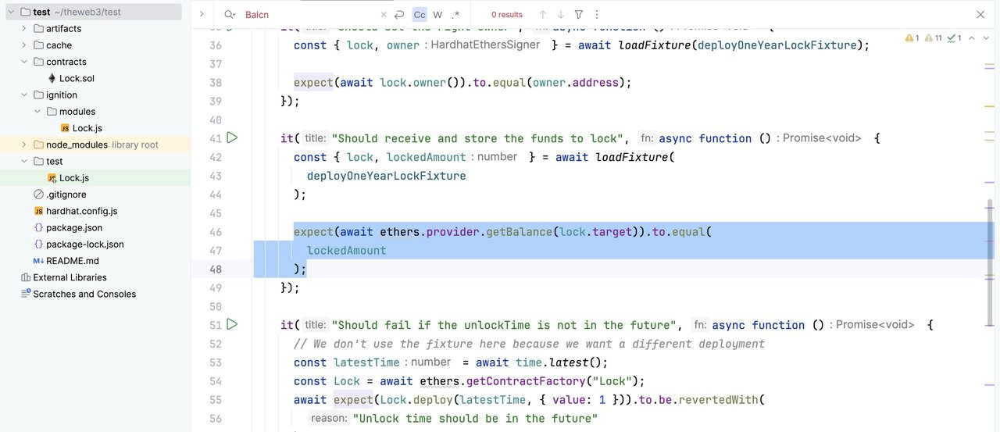
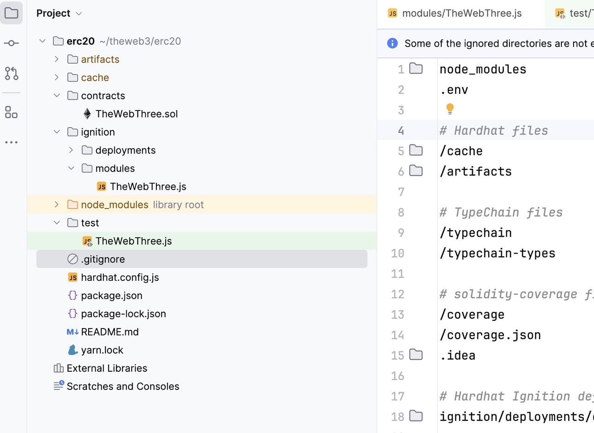

# Ethereum 智能合约开发工具之 RPC 服务和 Hardhat 的简单使用介绍

# 一.主流的 RPC 服务商

- Alchemy: https://www.alchemy.com/
- Quicknode: https://www.quicknode.com/
- Ankr: https://www.ankr.com/
- Infura: https://www.infura.io/zh
- GetBlock: https://getblock.io/

Chainlist 也可以找到 RPC 节点

- ChainList: https://chainlist.org/

# 二. Hardhat 使用介绍

hardhat 是一个用于构建、测试、部署和维护以太坊智能合约的开发环境。它提供了一系列工具和插件，使开发人员可以更高效地工作。

## 1.Hardhat 初体验

**1.1.安装与初始化**

```bash
npm install --save-dev hardhat
```

**1.2.初始化项目**

```
npx hardhat
或者
npx hardhat init
```

- 输出如下

```
What do you want to do? …
❯ Create a JavaScript project
  Create a TypeScript project
  Create a TypeScript project (with Viem)
  Create an empty hardhat.config.js
  Quit
```

选择你喜欢的方式往下执行, 执行之后你后得到下面目录结构的代码



- Contract: 存放合约代码的目录
- Ignition/modules: 部署脚本目录
- Test: 测试脚本目录
- hardhat.config.js：配置文件，网络和其他配置

若是 Ts 的方式生成，还有很多 ts 的配置文件

**1.3.hardhat 测试部署合约**

- 测试合约

```
npx hardhat test
```

1.3.1.本地部署合约

- 启动本地节点，以便部署和测试智能合约：

```
npx hardhat node
```

- 部署智能合约： 在终端中运行部署脚本

```
npx hardhat ignition deploy ignition/modules/xxx.js --network localhost
```

1.3.2. Sepolia 网络部署和验证合约

```
npx hardhat ignition deploy ignition/modules/xxx.js --network sepolia --verify
```

该--verify标志是可选的，但它告诉 Hardhat Ignition 在成功部署后验证合同。

如果您有现有部署并想要验证它，您也可以verify通过传递部署 ID 直接运行任务：

```
npx hardhat ignition verify chain-11155111
```

1.3.3. 参数执行部署

要使用参数执行部署，您需要使用参数--parameters，如下所示：

可以调用一个示例文件./ignition/parameters.json并包含以下内容：

```json
{"Apollo": {"name": "Saturn V"}}
```

这使得模块name的参数Apollo为"Saturn V"。

```
npx hardhat ignition deploy ignition/modules/Apollo.js --parameters ignition/parameters.json
```

1.3.4.检查现有部署

- ignition deployments 返回对应的部署 ID

```
npx hardhat ignition deployments
```

- 输出

```
chain-31337
```

- ignition status 返回信息部署信息

```
npx hardhat ignition status chain-31337
```

- 输出

```
Deployment chain-31337 (chainId: 31337) was successful

Deployed Addresses

TheWebThree#TheWebThree - 0x5FbDB2315678afecb367f032d93F642f64180aa3
```

1.3.5.可视化你的模块

```
npx hardhat ignition visualize ./ignition/modules/TheWebThree.js
```

- 执行完命令之后会生成一个 html, 里面展示了你 js 的所有函数调用情况

1.3.6.清除先前的执行

```
npx hardhat ignition wipe deploymentId futureId
```

1.3.7. 使用 reset 清除现有的部署

```
npx hardhat ignition deploy ignition/modules/Apollo.ts --network localhost --reset
```

1.3.8.使用 create2 部署

```
npx hardhat ignition deploy ignition/modules/Apollo.js --network sepolia --strategy create2
```

## 2.使用 Hardhat 开发一个 ERC20 代币合约

**2.1.创建目录**

```
mkdir erc20
npx hardhat init
```

**2.2.项目初始化完成之后改造代码得到以下结构**



- TheWebThree.sol 是核心合约，代码如下

```solidity
// contracts/MyTokenV1.sol
// SPDX-License-Identifier: MIT
pragma solidity ^0.8.0;

import "@openzeppelin/contracts-upgradeable/token/ERC20/ERC20Upgradeable.sol";
import "@openzeppelin/contracts-upgradeable/proxy/utils/Initializable.sol";

contract TheWebThree is Initializable, ERC20Upgradeable {
     address payable public owner;

    function initialize(uint256 initialSupply) external initializer {
        __ERC20_init("TheWebThree", "TWT");
        _mint(msg.sender, initialSupply);

        owner = payable(msg.sender);
    }
}
```

- ignition/modules 下面的 TheWebThree.js 是部署脚本

```javascript
const { buildModule } = require("@nomicfoundation/hardhat-ignition/modules");


module.exports = buildModule("TheWebThree", (m) => {
    const InitialSupply = 1_000_000_000;
    const theWeb3Contract = m.contract("TheWebThree");

    m.call(theWeb3Contract, "initialize", [InitialSupply], { after: [theWeb3Contract] });

    return { theWeb3Contract };
});
```

- test 目录下 TheWebThree.js 的是测试脚本

```js
const {
    time,
    loadFixture,
} = require("@nomicfoundation/hardhat-toolbox/network-helpers");
const { anyValue } = require("@nomicfoundation/hardhat-chai-matchers/withArgs");
const { expect } = require("chai");
const BigNumber = require("bignumber.js");


describe("TheWebThree", function () {
    async function deployTheWebThree() {
        const initialSupply = 10000000000

        // const initialSupply = new BigNumber(amount).times(new BigNumber(10).pow(10e18));

        const [owner, otherAccount] = await ethers.getSigners();
        console.log(owner.address)
        console.log(otherAccount.address)

        const TheWebThree = await ethers.getContractFactory("TheWebThree");
        const theWebThree = await TheWebThree.deploy();

        await theWebThree.initialize(initialSupply)

        await theWebThree.transfer(owner, initialSupply);

        return { theWebThree, owner, otherAccount, initialSupply};
    }


    describe("Deployment", function () {
        it("Should set the right symbol", async function () {
            const { theWebThree, owner, otherAccount,initialSupply  } = await loadFixture(deployTheWebThree);
            expect(await theWebThree.symbol()).to.equal("TWT");
            expect(await theWebThree.name()).to.equal("TheWebThree");
            console.log("decimals==", await theWebThree.decimals())
        });

        it("Should set the right owner", async function () {
            const { theWebThree, owner, otherAccount, initialSupply } = await loadFixture(deployTheWebThree);
            expect(await theWebThree.owner()).to.equal(owner.address);
        });

        it("Should receive right balance", async function () {
            const { theWebThree, owner, otherAccount,initialSupply  } = await loadFixture(deployTheWebThree);
            const balanceOf = await ethers.provider.getBalance(await theWebThree.owner())
            console.log(balanceOf)
            // expect(balanceOf).to.equal(initialSupply);
        });

    });


});
```

- hardhat.config.js 网络配置相关的代码

```js
require("@nomicfoundation/hardhat-toolbox");

/** @type import('hardhat/config').HardhatUserConfig */
module.exports = {
  solidity: {
    version: "0.8.24",
    settings: {
      optimizer: {
        enabled: true,
        runs: 200
      }
    }
  },
  networks: {
    sepolia: {
      url: "https://sepolia.infura.io/v3/apiKey",
      accounts: ["privateKey"]
    },
    bsctest: {
      url: `https://data-seed-prebsc-1-s1.binance.org:8545/`,
      accounts: ["privateKey"]
    },
  },
  etherscan: {
    apiKey: "apiKey",
  }
};
```

## 3.执行测试与部署

**3.1.测试**

- 执行测试命令

```
npx hardhat test
```

- 输出结果

```
TheWebThree
    Deployment
0xf39Fd6e51aad88F6F4ce6aB8827279cffFb92266
0x70997970C51812dc3A010C7d01b50e0d17dc79C8
decimals== 18n
      ✔ Should set the right symbol (402ms)
      ✔ Should set the right owner
9999998340779823021046n
      ✔ Should receive right balance


  3 passing (410ms)
```

**3.2.本地部署**

- 启动节点命令

```
npx hardhat node
```

- 返回值

```
Started HTTP and WebSocket JSON-RPC server at http://127.0.0.1:8545/

Accounts
========

WARNING: These accounts, and their private keys, are publicly known.
Any funds sent to them on Mainnet or any other live network WILL BE LOST.

Account #0: 0xf39Fd6e51aad88F6F4ce6aB8827279cffFb92266 (10000 ETH)
Private Key: 0xac0974bec39a17e36ba4a6b4d238ff944bacb478cbed5efcae784d7bf4f2ff80

Account #1: 0x70997970C51812dc3A010C7d01b50e0d17dc79C8 (10000 ETH)
Private Key: 0x59c6995e998f97a5a0044966f0945389dc9e86dae88c7a8412f4603b6b78690d
```

- 本地部署合约命令

```
npx hardhat ignition deploy ignition/modules/TheWebThree.js --network localhost
```

- 输出结果

```
Hardhat Ignition 🚀

Deploying [ TheWebThree ]

Batch #1
  Executed TheWebThree#TheWebThree

Batch #2
  Executed TheWebThree#TheWebThree.initialize

[ TheWebThree ] successfully deployed 🚀

Deployed Addresses

TheWebThree#TheWebThree - 0x5FbDB2315678afecb367f032d93F642f64180aa3
```

**3.3. Sepolia 部署**

- 部署命令

```
npx hardhat ignition deploy ignition/modules/TheWebThree.js --network sepolia --verify
```

- 输出结果

```
✔ Confirm deploy to network sepolia (11155111)? … yes

Hardhat Ignition 🚀

Deploying [ TheWebThree ]

Batch #1
  Executed TheWebThree#TheWebThree

Batch #2
  Executed TheWebThree#TheWebThree.initialize

[ TheWebThree ] successfully deployed 🚀

Deployed Addresses

TheWebThree#TheWebThree - 0x3bBb5B55A0054c10a176C932B8b9d7775CE22419

Verifying deployed contracts

Verifying contract "contracts/TheWebThree.sol:TheWebThree" for network sepolia...
```

上面的其他的命令就不在这里再做过多赘述，比较简单的，课程中咱们详解讲解, 