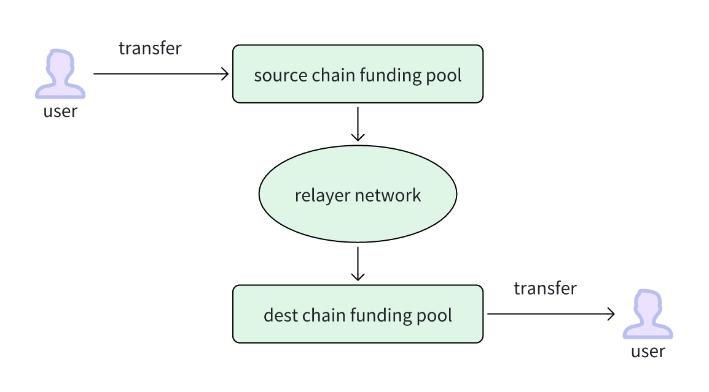
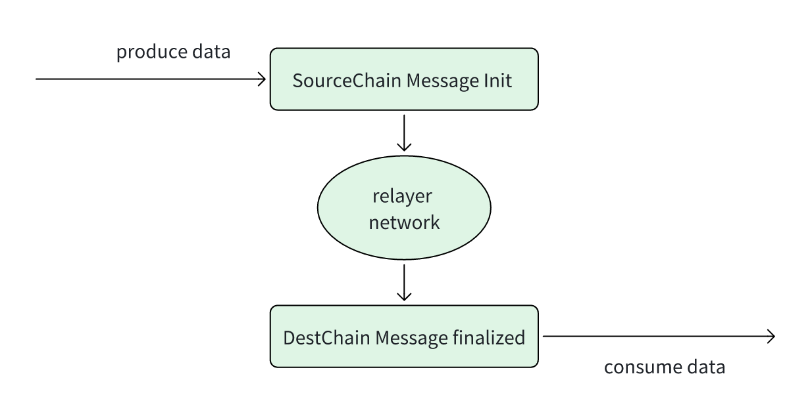

# The Web3 项目实战--深入理解 DappLink Bridge 智能合约实现机制

# 一.协议概述

DappLink 跨链互操作协议是一个基于 ZKP 的任意链到任意链的数据和资产跨链协议，目前已经支持 EVM 系列链之间的数据和资产跨链。

# 1.重点协议设计

## 1.1.资产跨链



## 1.2.数据跨链



# 二.业务实现流程

## 1.资产质押

Relayer 每隔一个周期会在以太坊上自动创建质押池, 没有 cliam 资产的用户的资金继续流转到新的质押池，新用户质押将在下一期开启之后生效，创建质押池的代码如下：

```solidity
function CompletePoolAndNew(
    Pool[] memory CompletePools
) external payable onlyRole(ReLayer) {
    for (uint256 i = 0; i < CompletePools.length; i++) {
        address _token = CompletePools[i].token;
        uint PoolIndex = Pools[_token].length - 1;
        Pools[_token][PoolIndex - 1].IsCompleted = true;
        if (PoolIndex - 1 != 0) {
            Pools[_token][PoolIndex - 1].TotalFee = FeePoolValue[_token];
            FeePoolValue[_token] = 0;
        }
        uint32 startTimes = Pools[_token][PoolIndex].endTimestamp;
        Pools[_token].push(
            Pool({
                startTimestamp: startTimes,
                endTimestamp: startTimes + periodTime,
                token: _token,
                TotalAmount: Pools[_token][PoolIndex].TotalAmount,
                TotalFee: 0,
                TotalFeeClaimed: 0,
                IsCompleted: false
            })
        );
        emit CompletePoolEvent(_token, PoolIndex);
    }
}
```

用户将自己的 Token 质押给以太坊上的 FundingPool，网络中每发生一笔交易质押者都会获取一定的收益

- 质押方法，质押方法里面包含了质押 ETH 和 Token,  Token 这里只含同质化代币，非同质化代币 NFT 这样的我们是通过 lock, unlock, mint, burn 的方式来实现的，不需要散户进行质押。

```solidity
function DepositAndStaking(
    address _token,
    uint256 _amount
) public payable override whenNotPaused {
    if (msg.value > 0) {
        DepositAndStakingETH();
    } else if (_token == ContractsAddress.WETH) {
        DepositAndStakingWETH(_amount);
    } else if (IsSupportToken[_token]) {
        DepositAndStakingERC20(_token, _amount);
    }
}
```

- ETH 质押，主要功能是用户把钱打入到合约，合约里面会记录用户的资金，做为未来奖励和提取本金的证明，代码如下：

```solidity
function DepositAndStakingETH()
    public
    payable
    override
    nonReentrant
    whenNotPaused
{
    if (msg.value < MinStakeAmount[address(ContractsAddress.ETHAddress)]) {
        revert LessThanMinStakeAmount(
            MinStakeAmount[address(ContractsAddress.ETHAddress)],
            msg.value
        );
    }

    if (Pools[address(ContractsAddress.ETHAddress)].length == 0) {
        revert NewPoolIsNotCreate(1);
    }
    uint256 PoolIndex = Pools[address(ContractsAddress.ETHAddress)].length -
        1;
    /*if (
        Pools[address(ContractsAddress.ETHAddress)][PoolIndex].IsCompleted
    ) {
        revert PoolIsCompleted(PoolIndex);
    }*/
    if (
        Pools[address(ContractsAddress.ETHAddress)][PoolIndex]
            .startTimestamp > block.timestamp
    ) {
        Users[msg.sender].push(
            User({
                isWithdrawed: false,
                StartPoolId: PoolIndex,
                EndPoolId: 0,
                token: ContractsAddress.ETHAddress,
                Amount: msg.value
            })
        );
        Pools[address(ContractsAddress.ETHAddress)][PoolIndex]
            .TotalAmount += msg.value;
    } else {
        revert NewPoolIsNotCreate(PoolIndex + 1);
    }
    FundingPoolBalance[ContractsAddress.ETHAddress] += msg.value;
    emit StakingETHEvent(msg.sender, msg.value);
}
```

- WETH 质押，主要功能是用户把钱打入到合约，合约里面会记录用户的资金，做为未来奖励和提取本金的证明，与其他 Token 不一样的是，质押 WETH 的用户，未来本金提取可以提取 ETH， 代码如下：

```solidity
function DepositAndStakingWETH(
    uint256 amount
) public override nonReentrant whenNotPaused {
    if (amount < MinStakeAmount[address(ContractsAddress.WETH)]) {
        revert LessThanMinStakeAmount(
            MinStakeAmount[address(ContractsAddress.WETH)],
            amount
        );
    }

    IWETH(ContractsAddress.WETH).transferFrom(
        msg.sender,
        address(this),
        amount
    );

    if (Pools[address(ContractsAddress.WETH)].length == 0) {
        revert NewPoolIsNotCreate(1);
    }
    uint256 PoolIndex = Pools[address(ContractsAddress.WETH)].length - 1;
    /*if (Pools[address(ContractsAddress.WETH)][PoolIndex].IsCompleted) {
        revert PoolIsCompleted(PoolIndex);
    }*/
    if (
        Pools[address(ContractsAddress.WETH)][PoolIndex].startTimestamp >
        block.timestamp
    ) {
        Users[msg.sender].push(
            User({
                isWithdrawed: false,
                StartPoolId: PoolIndex,
                EndPoolId: 0,
                token: ContractsAddress.WETH,
                Amount: amount
            })
        );
        Pools[address(ContractsAddress.WETH)][PoolIndex]
            .TotalAmount += amount;
    } else {
        revert NewPoolIsNotCreate(PoolIndex + 1);
    }
    FundingPoolBalance[ContractsAddress.WETH] += amount;
    emit StakingWETHEvent(msg.sender, amount);
}
```

- ERC20 质押：主要功能是用户把钱打入到合约，合约里面会记录用户的资金，做为未来奖励和提取本金的证明，代码如下：

```solidity
function DepositAndStakingERC20(
    address _token,
    uint256 _amount
) public override nonReentrant whenNotPaused {
    if (!IsSupportToken[_token]) {
        revert TokenIsNotSupported(_token);
    }
    if (_amount < MinStakeAmount[_token]) {
        revert LessThanMinStakeAmount(MinStakeAmount[_token], _amount);
    }
    uint256 BalanceBefore = IERC20(_token).balanceOf(address(this));
    IERC20(_token).safeTransferFrom(msg.sender, address(this), _amount);
    uint256 BalanceAfter = IERC20(_token).balanceOf(address(this));
    _amount = BalanceAfter - BalanceBefore;

    if (Pools[_token].length == 0) {
        revert NewPoolIsNotCreate(1);
    }
    uint256 PoolIndex = Pools[_token].length - 1;
    if (Pools[_token][PoolIndex].startTimestamp > block.timestamp) {
        Users[msg.sender].push(
            User({
                isWithdrawed: false,
                StartPoolId: PoolIndex,
                EndPoolId: 0,
                token: _token,
                Amount: _amount
            })
        );
        Pools[_token][PoolIndex].TotalAmount += _amount;
    } else {
        revert NewPoolIsNotCreate(PoolIndex + 1);
    }
    FundingPoolBalance[_token] += _amount;
    emit StarkingERC20Event(msg.sender, _token, _amount);
}
```

Relayer 的资金平衡程序按照一定规则将资金划转到其他的各个网络

- Relayer 是一个链下服务，他会根据事先配置好的资金平衡规则，将资金划转到其他 ETH Layer2 上，资金平衡针对的是有关联的网络，例如：ETH 及其 Layer2, BTC 及其 Layer2。资金平衡规则的代码这里我们就不做讲解了。

## 2.资产跨链

用户将资金转入到源链的 FundingPool, Relayer 监听到这笔交易之后，生成交易证明，将交易证明丢到目标链上；Relayer 在目标链上帮助用户 Claim 资金,  交易证明有效之后，Relayer 从目标链的 FundingPool 将钱划转到用户的地址

**2.1 ETH 资产跨链**

- ETH 跨链源链：用户把资金转到源链的资金池，对应方法为 BridgeInitiateETH；代码如下：

```solidity
function BridgeInitiateETH(
    uint256 sourceChainId,
    uint256 destChainId,
    address to
) external payable returns (bool) {
    if (sourceChainId != block.chainid) {
        revert sourceChainIdError();
    }
    if (!IsSupportChainId(destChainId)) {
        revert ChainIdIsNotSupported(destChainId);
    }
    if (msg.value < MinTransferAmount) {
        revert LessThanMinTransferAmount(MinTransferAmount, msg.value);
    }
    FundingPoolBalance[ContractsAddress.ETHAddress] += msg.value;

    uint256 fee = (msg.value * PerFee) / 1_000_000;
    uint256 amount = msg.value - fee;
    FeePoolValue[ContractsAddress.ETHAddress] += fee;

    messageManager.sendMessage(block.chainid, destChainId, to, amount, fee);

    emit InitiateETH(sourceChainId, destChainId, msg.sender, to, amount);
    return true;
}
```

- ETH 跨链目标链：Relayer 网络完成交易证明之后，将目标链的资金池的资金划转到用户指定的地址上；对应方法为 BridgeInitiateETH；代码如下：

```solidity
function BridgeFinalizeETH(
    uint256 sourceChainId,
    uint256 destChainId,
    address to,
    uint256 amount,
    uint256 _fee,
    uint256 _nonce
) external payable onlyRole(ReLayer) returns (bool) {
    if (destChainId != block.chainid) {
        revert sourceChainIdError();
    }
    if (!IsSupportChainId(sourceChainId)) {
        revert ChainIdIsNotSupported(sourceChainId);
    }
    (bool _ret, ) = payable(to).call{value: amount}("");
    if (!_ret) {
        revert TransferETHFailed();
    }
    FundingPoolBalance[ContractsAddress.ETHAddress] -= amount;

    messageManager.claimMessage(
        sourceChainId,
        destChainId,
        to,
        _fee,
        amount,
        _nonce
    );

    emit FinalizeETH(sourceChainId, destChainId, address(this), to, amount);
    return true;
}
```

**2.2 WETH 资产跨链**

- WETH 跨链源链：用户把资金转到源链的资金池，对应方法为 BridgeInitiateWETH；代码如下：

```solidity
function BridgeInitiateWETH(
    uint256 sourceChainId,
    uint256 destChainId,
    address to,
    uint256 value
) external returns (bool) {
    if (sourceChainId != block.chainid) {
        revert sourceChainIdError();
    }
    if(sourceChainId == destChainId){
        revert sourceChainIsDestChainError();
    }
    if (!IsSupportChainId(destChainId)) {
        revert ChainIdNotSupported(destChainId);
    }

    IWETH WETH = IWETH(L2WETH());

    uint256 BalanceBefore = WETH.balanceOf(address(this));
    WETH.transferFrom(msg.sender, address(this), value);
    uint256 BalanceAfter = WETH.balanceOf(address(this));
    uint256 amount = BalanceAfter - BalanceBefore;
    if (amount < MinTransferAmount) {
        revert LessThanMinTransferAmount(MinTransferAmount, amount);
    }
    FundingPoolBalance[ContractsAddress.WETH] += amount;

    uint256 fee = (amount * PerFee) / 1_000_000;
    amount -= fee;
    FeePoolValue[ContractsAddress.WETH] += fee;

    messageManager.sendMessage(sourceChainId, destChainId, to, amount, fee);

    emit InitiateWETH(sourceChainId, destChainId, msg.sender, to, amount);

    return true;
}
```

- WETH 跨链目标链：Relayer 网络完成交易证明之后，将目标链的资金池的资金划转到用户指定的地址上；对应方法为 BridgeInitiateWETH；代码如下：

```solidity
function BridgeFinalizeWETH(
    uint256 sourceChainId,
    uint256 destChainId,
    address to,
    uint256 amount,
    uint256 _fee,
    uint256 _nonce
) external onlyRole(ReLayer) returns (bool) {
    if (destChainId != block.chainid) {
        revert sourceChainIdError();
    }
    if (!IsSupportChainId(sourceChainId)) {
        revert ChainIdIsNotSupported(sourceChainId);
    }

    IWETH WETH = IWETH(L2WETH());
    WETH.transfer(to, amount);
    FundingPoolBalance[ContractsAddress.WETH] -= amount;

    messageManager.claimMessage(
        sourceChainId,
        destChainId,
        to,
        _fee,
        amount,
        _nonce
    );

    emit FinalizeWETH(
        sourceChainId,
        destChainId,
        address(this),
        to,
        amount
    );
    return true;
}
```

**2.3 ERC20 资产跨链**

- ERC20 跨链源链：用户把资金转到源链的资金池，对应方法为 BridgeInitiateERC20；代码如下：

```solidity
function BridgeInitiateERC20(
    uint256 sourceChainId,
    uint256 destChainId,
    address to,
    address ERC20Address,
    uint256 value
) external returns (bool) {
    if (sourceChainId != block.chainid) {
        revert sourceChainIdError();
    }
    if (!IsSupportChainId(destChainId)) {
        revert ChainIdIsNotSupported(destChainId);
    }
    if (!IsSupportToken[ERC20Address]) {
        revert TokenIsNotSupported(ERC20Address);
    }

    uint256 BalanceBefore = IERC20(ERC20Address).balanceOf(address(this));
    IERC20(ERC20Address).safeTransferFrom(msg.sender, address(this), value);
    uint256 BalanceAfter = IERC20(ERC20Address).balanceOf(address(this));
    uint256 amount = BalanceAfter - BalanceBefore;
    FundingPoolBalance[ERC20Address] += value;
    uint256 fee = (amount * PerFee) / 1_000_000;
    amount -= fee;
    FeePoolValue[ERC20Address] += fee;

    messageManager.sendMessage(sourceChainId, destChainId, to, amount, fee);

    emit InitiateERC20(
        sourceChainId,
        destChainId,
        ERC20Address,
        msg.sender,
        to,
        amount
    );

    return true;
}
```

- ERC20 跨链目标链：Relayer 网络完成交易证明之后，将目标链的资金池的资金划转到用户指定的地址上；对应方法为 BridgeFinalizeERC20；代码如下：

```solidity
function BridgeFinalizeERC20(
    uint256 sourceChainId,
    uint256 destChainId,
    address to,
    address ERC20Address,
    uint256 amount,
    uint256 _fee,
    uint256 _nonce
) external onlyRole(ReLayer) returns (bool) {
    if (destChainId != block.chainid) {
        revert sourceChainIdError();
    }
    if (!IsSupportChainId(sourceChainId)) {
        revert ChainIdIsNotSupported(sourceChainId);
    }
    if (!IsSupportToken[ERC20Address]) {
        revert TokenIsNotSupported(ERC20Address);
    }
    IERC20(ERC20Address).safeTransfer(to, amount);
    FundingPoolBalance[ERC20Address] -= amount;

    messageManager.claimMessage(
        sourceChainId,
        destChainId,
        to,
        _fee,
        amount,
        _nonce
    );

    emit FinalizeERC20(
        sourceChainId,
        destChainId,
        ERC20Address,
        address(this),
        to,
        amount
    );
    return true;
}
```

## 3.奖励和本金提现

- 用户可以随时提取自己的奖励和本金，若本期未结束用户就提取奖励和本金，用户只能获得截止到上一期的收益, 代码如下：

```solidity
function WithdrawOrClaimBySimpleAsset(
    address _user,
    address _token,
    bool IsWithdraw
) internal {
    if (Pools[_token].length == 0) {
        revert NewPoolIsNotCreate(0);
    }
    for (uint256 index = 0; index < Users[_user].length; index++) {
        if (Users[_user][index].token == _token) {
            if (Users[_user][index].isWithdrawed) {
                continue;
            }

            uint256 EndPoolId = Pools[_token].length - 1;

            uint256 Reward = 0;
            uint256 Amount = Users[_user][index].Amount;
            uint256 startPoolId = Users[_user][index].StartPoolId;
            /*if (startPoolId > EndPoolId) {
                revert NoReward();
            }*/

            for (uint256 j = startPoolId; j < EndPoolId; j++) {
                uint256 _Reward = (Amount *
                    Pools[_token][j].TotalFee *
                    1e18) / Pools[_token][j].TotalAmount;
                Reward += _Reward / 1e18;
                Pools[_token][j].TotalFeeClaimed += _Reward;
            }
            //require(Reward > 0, "No Reward");
            Amount += Reward;
            Users[_user][index].isWithdrawed = true;
            if (IsWithdraw) {
                Pools[_token][EndPoolId].TotalAmount -= Users[_user][index]
                    .Amount;
                SendAssertToUser(_token, _user, Amount);
                if (Users[_user].length > 0) {
                    Users[_user][index] = Users[_user][
                        Users[_user].length - 1
                    ];
                    Users[_user].pop();
                    index--;
                }
                emit Withdraw(
                    _user,
                    startPoolId,
                    EndPoolId,
                    _token,
                    Amount - Reward,
                    Reward
                );
            } else {
                Users[_user][index].StartPoolId = EndPoolId;
                SendAssertToUser(_token, _user, Reward);
                emit ClaimReward(
                    _user,
                    startPoolId,
                    EndPoolId,
                    _token,
                    Reward
                );
            }
        }
    }
}
```

## 4.数据跨链

- 源链发送数据跨链的交易, Relayer 监听到这笔交易之后，生成交易证明，将交易证明丢到目标链上
- Relayer 在目标链上消费数据,  交易证明有效之后，Relayer 在目标帮助数据消费

# 三. 总结

- DappLink 合约项目地址：https://github.com/eniac-x-labs/bridge-contracts
- DappLink 合约事件监听器：https://github.com/eniac-x-labs/acorus
- DappLink Relayer 网络部分代码：https://github.com/eniac-x-labs/selaginella