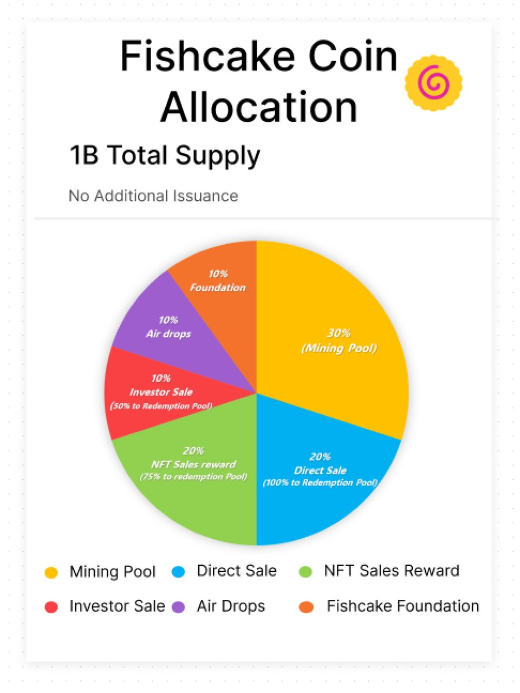
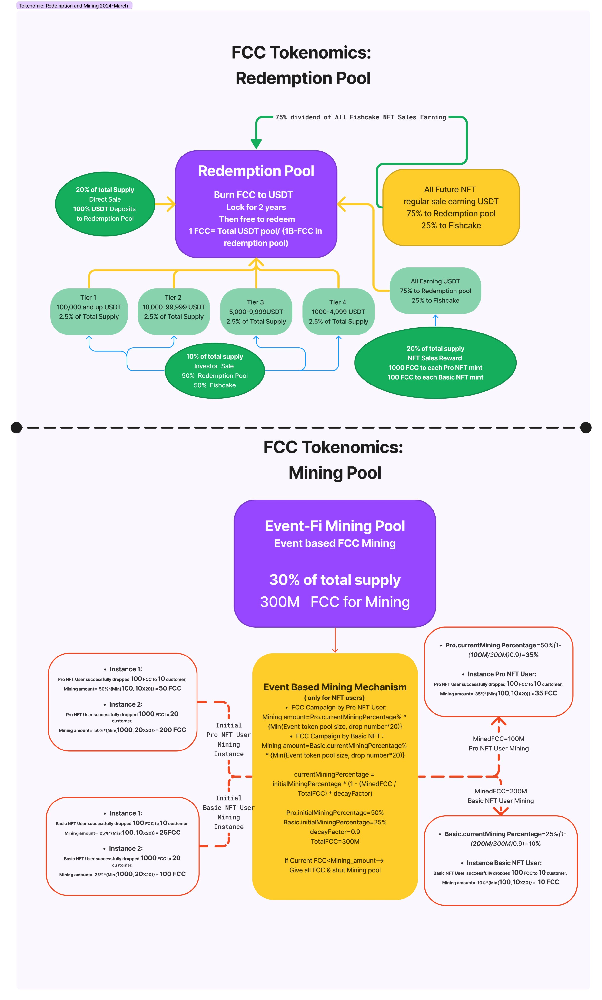
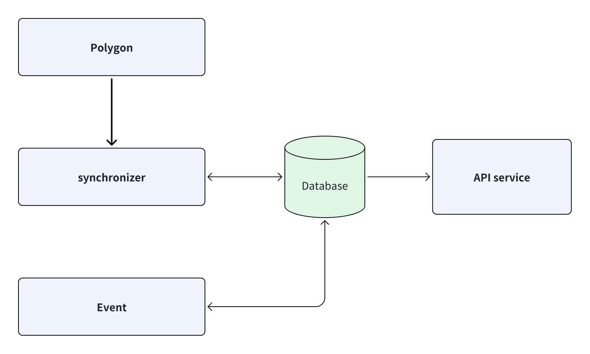

# The Web3 社区项目实战之-- Web3 史上第一个  EventFi 项目 FishCake

# 一.项目概述

## 1.**关于 Fishcake**

Fishcake平台赋予本地商家直接通过区块链发起和管理基于代币的激励活动，无需中间商，通过用户友好的 Web3 应用将商家直接连接到客户。我们的平台消除了中间商，增强了透明度，促进了更深层次的社区参与，并构建了可持续的经济生态系统。

- 官方网站：https://www.fishcake.org/
- Dapp 网站：https://www.fishcake.org/
- Discord 频道：https://discord.com/invite/hbHBW5Jq2s
- Telegram: https://t.me/fishcake_official
- X: https://x.com/fishcake_labs
- Youtube: https://www.youtube.com/channel/UCwWaz6t7o00fhl8nY37Y5Ig

## 2.**核心功能**

- **代币化激励**：利用 Fishcake Coin (FCC) 或 USDT 参与和创建营销活动。
- **NFT 集成**：通过提供额外好处和功能的独特 NFT 通行证与平台互动。
- **分散运营**：在支持直接交互而不受第三方干扰的平台内运营。

# 二.项目功能简介与代币经济模型

## 1.基本功能描述

FishCake 是一个 EventFI 平台，NFT 认证商家和认证用户可以通过该平台发布自己的活动，发活动即挖矿的模式，发活动可以赚取 FCC 代币奖励。

## 2.FishCake 代币经济模型

**2.1.总供应量**

FCC 的总供应量上限为 10 亿，不会额外发行。



**2.2.代币分配**

初始分布反映了对社区参与的承诺，旨在确保代币的长期价值和可持续性，奖励早期采用者并维持Fishcake健康公平的经济生态系统。

- 矿池：20% 
💡激励活动创建和用户参与。
- 直接销售：20%; 
💡FCC=0.1 USDT，100% USDT 将分配到赎回池。
- 投资者销售：10%; 投资者销售的 50% USDT 将分配到赎回池。 
💡一级投资者销售：最低购买 50,000 - 100,000 USDT，1FCC=0.02 USDT 
💡二级投资者销售：最低购买 10,000 - 49,999 USDT，1FCC=0.04 USDT 
💡三级投资者销售：最低购买 5,000 - 9,999 USDT，1FCC=0.05 USDT 
💡四级投资者销售：最低购买 1,000 - 4,999 USDT，1FCC=0.06 USDT
- NFT 销售奖励：30% 
💡支持Fishcake生态系统中早期 NFT 个人简介验证用户。 
💡1 个 Fishcake 商家 NFT 头像铸造 - 1000 FCC 奖励 
💡1 个 Fishcake 用户 NFT 头像铸造 - 100 FCC 奖励 
💡75% 的所有NFT 销售收益 USDT 将分配到赎回池作为所有FCC持有者的股息。
- 早期空投：10% 
💡早期采用者，社区成员，生态系统贡献者
- 基金会：10% 
💡致力于生态系统发展和可持续性。

**2.3.赎回池：**

- 保证价值和共享成功: Fishcake通证经济的一个关键特征是赎回池，它确保了 FCC 的最低底价，并为持有者提供平台成功收益份额。每个 FCC 代表池中持有的 USDT 的比例份额（1FCC=总 USDT/1B）。该池通过三种 USDT 来源补充：
- 直接 FCC 销售：此次销售的全部 USDT 将分配到池中。
- 投资者销售：投资者销售所得 USDT 的 50% 分配到池中。
- NFT 销售：Fishcake NFT 市场所有 USDT 收益的 75% 直接分配到赎回池作为所有利益相关方的股息。 一旦池中充满 1 亿 FCC，其 FCC 持有量将转移到 Fishcake 基金会，支持生态系统的可持续性和未来举措，其中大部分 FCC 将补充矿池，我们不会转售任何 FCC 代币。

**2.4.挖矿机制：**

- 奖励活动参与和互动：Fishcake 的矿池激励平台上积极的活动运营商。验证过的 NFT 用户通过活动完成获得 FCC 奖励，根据公式考虑活动最低分配代币或每活动奖励人数来计算，这种设计鼓励活动创建，吸引用户，促进生态系统健康增长。
- 初始 2 亿 FCC 矿池： 
💡认证 NFT 商家： 
💡💡FCC 活动挖矿金额 = 50% * {最小值 (活动 FCC 池大小，投放数量 * 20)} 
💡💡USDT 活动挖矿金额 = 25% * {最小值 (活动 FCC 池大小，投放数量 * 20)} 
💡💡💡例子 1：商家成功向 10 个客户投放 100 FCC；挖矿金额 = 50% * {最小值 (100，10 X 20)} = 50 FCC 
💡💡💡例子 2：商家成功向 20 个客户投放 1000 FCC；挖矿金额 = 50% * {最小值 (1000，20 X 20)} = 200 FCC 
💡💡💡例子 3：商家成功向 10 个客户投放 100 USDT；挖矿金额 = 25% * {最小值 (100，10 X 20)}=25 FCC 
💡💡💡例子 4：商家成功向 20 个客户发放了 1000 FCC；挖矿金额 = 25% * {最小值 (1000, 20 X 20)} = 100 FCC 
💡认证 NFT 用户： 
💡💡FCC 活动挖矿金额 = 25% * {最小值 (活动 FCC 池大小，投放数量 * 20)} 
💡💡USDT 活动挖矿金额 = 12.5% * {最小值 (活动 FCC 池大小，投放数量 * 20)} 
💡💡💡例子 1：发起人成功向 10 个客户发放了 100 FCC；挖矿金额 = 25% * {最小值 (100, 10 X 20)} = 25 FCC 
💡💡💡例子 2：发起人成功向 20 个客户发放了 1000 FCC; 挖矿金额 = 25% * {最小值 (1000, 20 X 20)} = 100 FCC 
💡💡💡例子 3：发起人成功向 10 个客户发放了 100 USDT；挖矿金额 = 12.5% * {最小值 (100, 10 X 20)} = 12.5 FCC 
💡💡💡例子 4：发起人成功向 20 个客户发放了 1000 FCC；挖矿金额 = 12.5% * {最小值 (1000, 20 X 20)} = 50 FCC

**2.5.分配细节流程图**



# 三. **Fishcake Coin 价值和优势**

- 最低价值保证： 赎回池确保 FCC 的最低底价，减轻市场波动并为持有者提供稳定性。
- 平台成功带来的分红： 持有者通过赎回池分享 Fishcake 销售收入的一部分，直接受益于平台的增长。
- 挖矿奖励： 认证的 NFT 用户可以通过活动运营积极赚取 FCC，奖励他们对生态系统的贡献。
- 治理权： 未来计划包括将 FCC 集成到链上治理机制中，允许持有者影响平台决策并塑造其未来。

# 四. 代码功能与详解

## 1.合约功能与**代码详解**

**1.1.合约代码仓库：**

- https://github.com/the-web3/fishcake-contracts
- https://github.com/FishcakeLab/fishcake-contracts

**1.2 忽略文件(看上去这些代码暂时无用，后期应该会删)**

```
src/contracts/core/FccToken.sol
src/contracts/core/UsdtToken.sol
src/contracts/core/NftTokenManager.sol
```

**1.3. fishcake 代币合约**

src/contracts/core/token/FishcakeCoin.sol

- MerchantManger: 占总供应量的 30%
- DirectSalePool: 占总供应量的 20%
- InvestorSalePool: 占总供应量的 10%
- NFTManager: 占总供应量的 20%
- EarlyStageAirdropsPool:占总供应量的 10%
- FoundationPool: 占总供应量的 10%

**1.4.FCC 赎回池合约**

src/contracts/core/RedemptionPool.sol

Fishcake 代币模型有一个关键元素，即赎回池，它确保 FCC 的最低底价，并向持有者提供平台成功收益份额。每个 FCC 代表池中持有的 USDT 的比例份额。这个 FCC 赎回池将在两年后解锁，激活一个机制，FCC 可以被销毁以换取 USDT。1 FCC = 池中的 USDT 总量 /（10 亿 - 已销毁的 FCC）。

这种销毁赎回机制保证了FCC的最低底价，奖励了长期的生态系统支持者，并为共享收益的长期增长提供了愿景。

该赎回池中的USDT余额来自三个来源：

- 直接FCC销售：这些销售产生的所有USDT都分配给该池。
- 投资者销售：投资者销售的50% USDT分配给该池。
- NFT销售

**1.5.直接 FCC 销售**

src/contracts/core/sale/DirectSalePool.sol

直接 FCC 销售：这些销售的所有 USDT 都分配给了资金池。

**1.6.投资者销售**

src/contracts/core/sale/InvestorSalePool.sol

投资者销售：投资者销售的 USDT 的 50% 被分配给该池。

**1.7.NFT 合约**

src/contracts/core/NFTManager.sol

“NFT 市场产生的所有 USDT 收益的 75% 都直接分配到赎回池中，作为所有利益相关者的红利。

createNFT NFT 固定只有两种类型，每种由两张图片组成，仅供授权使用。

- 类型 1 售价 80U
- 类型 2 售价 8U

有效期均为30天。到期后，权限失效。 权限体现在商家挖矿活动中。NFT 挖矿奖励：

- 类型 1 奖励 1000 FCC
- 类型 2 奖励 100 FCC

**1.8.商户活动管理**

src/contracts/core/MerchantManger.sol

- activityAdd==>活动发布
- drop ==>商家向会员发放奖励
- activityFinish ==>商家结束活动 **mining**

**1.9.其他**

- 获取当前挖矿币量百分比
Mined_FCC ≤ 30M -- Pro.currentMiningPercentage = 50% 
30M < Mined_FCC ≤ 100M -- Pro.currentMiningPercentage = 40% 
100M < Mined_FCC ≤ 200M -- Pro.currentMiningPercentage = 20% 
200M < Mined_FCC ≤ 300M -- Pro.currentMiningPercentage = 10%
- 平台举办的每场FCC发布活动，活动发起人均可按照活动消耗代币总量的50%或总参与人数的50%乘以20（取较小者）进行代币挖矿。

## 2. FishCake Services 代码详解

**2.1.代码架构**



- Synchronizer: 同步和 FishCake 相关的合约事件，批量插入到数据库; 对应代码：

  https://github.com/the-web3/fishcake-service/blob/main/synchronizer/synchronizer.go

- EventHandler: 从数据里面取出合约事件按照业务需求处理之后入到业务数据库, 对应代码：

  https://github.com/the-web3/fishcake-service/blob/main/event/polygon/polygon.go

- API service: 提供 API 给 FishCake 前端使用, 对应代码：

  https://github.com/the-web3/fishcake-service/tree/main/api

## 2. 运行这个项目

- 编译代码

```
make
```

- 配置 yaml 文件

```
migrations: "./migrations"
#polygon_rpc: "https://polygon-mumbai.infura.io/v3/f22a689113714ae8a41d02b18e1b1f7d"
polygon_rpc: "https://polygon-mainnet.g.alchemy.com/v2/CIZMD_P-HQWswRx6-n8uar5ONYLN02sb"
rpc_url: "193.203.215.185:8189"
polygon_chain_id: "80001"
http_host: "127.0.0.1"
http_port: 8087
db_host: "127.0.0.1"
db_port: 5432
db_name: "fishcake"
db_user: "guoshijiang"
db_password: ""
metrics_host:
metrics_port:
start_block: 58013559
eventStartBlock: 58013559
contracts:
    - "0xE967Df5072C00051a7Df26D8E736b8769fB991b5"
    - "0x4907e1fA441673CC004415784430179B8B4938Cf"
```

- 创建并生成数据

```
create database fishcake;
./fishcake migrate
```

- 运行合约事件监听服务

```
./fishcake index
```

- 运行 API 服务

```
./fishcake api
```

# 三.总结

Fishcake 对于很多学习 Web3 项目的小伙伴来说，绝对是可选学习的项目之一，FishCake 整个项目不管是经济模型的设计，还是代码架构，都有其突出的点。

从代币经济学上说：Fishcake Coin（FCC）作为生态系统的原生代币，为利益相关者提供了其他加密货币无法比拟的独特效用；FCC 的稳定性和长期价值也通过创新的 Burn to Redeem 和 Mining Tokenomics设计得到保证，这种模式设计比很多项目的经济模型更具备吸引用户的能力，并且也能使整个项目的可持续性得到保障。

从代码架构上来说：不管是合约代码还是链下服务的代码，都选用分层设计模式，整体代码的架构很清晰，代码可读性非常好，也很适合二次开发。

# 四.参考链接

- Fishcake github: https://github.com/FishcakeLab/
- Fish Cake 代币经济学：https://github.com/FishcakeLab/Fishcake-Tokenomics
- FishCake 官网：https://www.fishcake.org/